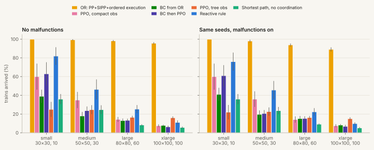

# rl-flatland-rescheduling

**Literature review and Scheduling Lab: <https://leandergrech.github.io/rl-flatland-rescheduling/>**

Can multi-agent reinforcement learning close the gap to operations research on railway
rescheduling? Flatland (SBB, Deutsche Bahn, SNCF, AIcrowd; now the Flatland Association) asks
trains on a grid-drawn network to reach their targets within timetable windows, without sharing
cells, while random malfunctions stop them. OR has won every official round: in NeurIPS 2020 the
best OR entry got 98.6% of trains home and the best RL entry 78.5%, and at ECML 2026 the best
planner scored 20.84 against 9.42 for the RL baseline. This repository is a verified literature
review of that gap (2019 to 2026) and a CPU-sized codebase to work on it. It has four fixed mid-size
scenarios, an OR reference that reproduces the core of the winning planners, a parameter-shared
PPO baseline, and an imitation-then-PPO baseline, all evaluated by one harness on held-out seeds
with and without malfunctions. The site explains the mechanisms chapter by chapter with
interactive widgets and ends in a **Scheduling Lab**: flatland itself, ported to JavaScript and
checked step for step against flatland-rl on 40 held-out maps, where you can replay every policy,
run the planner, break trains and dispatch yourself.

**Scope:** 30×30 to 100×100 grids with 10 to 100 trains. Every baseline trains and evaluates on a
laptop CPU in under an hour. The competitions went up to 314×314 cells and 6,256 trains; see
[limitations](docs/05-limitations.md).

## Quick start

```bash
git clone https://github.com/leandergrech/rl-flatland-rescheduling.git
cd rl-flatland-rescheduling
python3.12 -m venv .venv && source .venv/bin/activate      # or: uv venv --python 3.12 .venv
pip install torch --index-url https://download.pytorch.org/whl/cpu   # CPU-only torch, optional
pip install -e ".[dev]"
pytest                                   # 34 tests, about 1 min
bash scripts/reproduce.sh                # re-evaluate stored baselines on small+medium, compare with data/results
mkdocs serve                             # the literature review locally
```

Then open `notebooks/01-explore.ipynb`.

## Results

<!-- README_RESULTS:START -->
<picture>
  <source media="(prefers-color-scheme: dark)" srcset="docs/assets/figures/results-arrival-dark.svg">
  
</picture>

| Policy | small 30×30, 10 trains | medium 50×50, 30 | large 80×80, 60 | xlarge 100×100, 100 | train + eval (min) |
|---|---|---|---|---|---|
| OR: PP+SIPP+ordered execution | 100.0 / 100.0 | 99.3 / 98.0 | 98.2 / 93.8 | 95.7 / 89.1 | 0.0 + 1.1 |
| PPO, compact obs | 60.0 / 60.0 | 35.0 / 36.0 | 14.3 / 14.2 | 7.5 / 7.5 | 30.3 + 6.7 |
| BC from OR | 39.0 / 41.0 | 18.0 / 19.7 | 13.0 / 15.2 | 7.9 / 8.2 | 0.5 + 2.7 |
| BC then PPO | 63.0 / 61.0 | 23.7 / 20.7 | 13.3 / 15.3 | 6.4 / 6.9 | 31.2 + 1.4 |
| PPO, tree obs | 25.0 / 22.0 | 24.7 / 22.7 | 16.5 / 16.3 | 16.0 / 15.0 | 31.3 + 22.0 |
| Reactive rule | 82.0 / 76.0 | 46.3 / 45.7 | 25.3 / 22.3 | 11.1 / 9.8 | 0.0 + 3.5 |
| Shortest path, no coordination | 36.0 / 36.0 | 24.7 / 23.7 | 8.3 / 9.2 | 5.7 / 5.2 | 0.0 + 0.8 |

Arrival rate in % on the 10 held-out seeds per scenario, without / with malfunctions (same seeds, rate 1/1000 per train-step, 20 to 50 steps). Mean over episodes. Wall-clock on a ThinkPad i7-1260P (16 threads) with 8 worker processes, while two unrelated training jobs shared the CPU (1-minute load average median 23, range 11 to 44, logged in data/results/run_log/).

<!-- README_RESULTS:END -->

## Layout

```
docs/                 the site (MkDocs Material): How it works chapters, the Scheduling Lab, Literature
docs/javascripts/     flatland-core.js (flatland's RailEnv and the OR planner in JS), tada-core.js,
                      lab.js (the Lab), widgets.js (chapter widgets), rail-draw.js, nav.js
src/rl_flatland/      scenarios.py (fixed scenarios + seeds), graph.py, deadlock.py, observations.py,
                      env.py (decision wrapper), evaluation.py, metrics.py, plotting.py, policies.py,
                      baselines/or_planner.py, baselines/ppo.py, baselines/imitation.py, baselines/rl_policy.py
scripts/              train.py, evaluate.py, reproduce.sh, check_reproduction.py
notebooks/            01-explore, 02-baseline, 03-first-experiment
data/                 scenarios/, results/, checkpoints/, demos/ (all committed, < 20 MB), fetch.py
tests/                env sanity tests and a smoke test per baseline
```

## Reproducing

- `bash scripts/reproduce.sh`: exports the scenario set, re-evaluates every stored baseline on the
  small and medium held-out seeds, and checks that arrival rate, normalised reward and deadlock
  counts match `data/results/` exactly (about 10 minutes on 8 workers).
- `FULL=1 bash scripts/reproduce.sh`: retrains PPO, imitation and PPO-tree (30-minute budget each),
  then evaluates everything on all four scenarios.
- `python scripts/evaluate.py --table` prints the stored summary.
- The Lab's JavaScript port of flatland: `python scripts/make_lab_data.py` exports the 40 small and
  medium held-out maps with five policies' recorded episodes (and the check fixtures, not committed),
  then `node scripts/check_lab.mjs` (any Node 18+) checks distances, replays, the live planner and
  the dispatcher's clearances against flatland-rl, step for step (40/40 maps).

## Licence

MIT for the code in this repository (see `LICENSE`). Third-party licences are listed in
[docs/07-references.md](docs/07-references.md). No third-party solver code is included; the OR
reference was written from the published papers.
