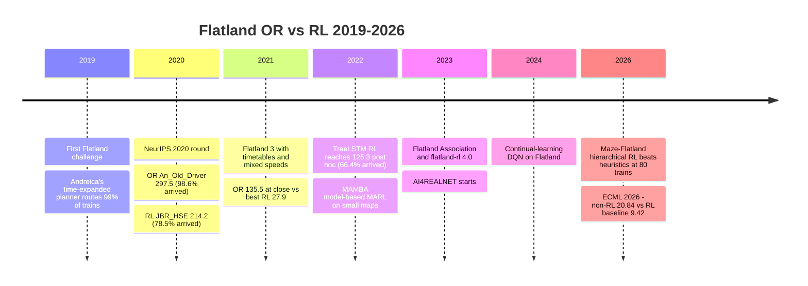

# :fl-timeline: Timeline of results, 2019 to 2026

Flatland's first public challenge ran in 2019
([Mohanty et al. 2020, §4.1](https://arxiv.org/abs/2012.05893)). We found no published Flatland
result from 2018. Scores from different rounds are **not comparable with each other**: each round
had its own generator, reward and number of test episodes. Compare OR against RL within a row
group, not across rows.

## Results table

| Date | Group | Method | Headline number | Source |
|---|---|---|---|---|
| 2019 to early 2020 | M.-I. Andreica (2019 challenge winner) | OR: per-train shortest paths in a time-expanded graph, fast trains first, each cell's visiting order kept after malfunctions | 99% of trains routed within the time limit on average | [arXiv:2111.07876](https://arxiv.org/abs/2111.07876) |
| 2020-04 | ZHAW + SBB (Roost et al.) | RL: A3C with LSTM, tree observation, learned communication actions, curriculum | 2-train switch scenario: 47% → 95% success with communication; 100×100 with 14 trains: 44.5% → 82.9% arrival after shrinking the decision space | [arXiv:2004.13439](https://arxiv.org/html/2004.13439) |
| 2020-12 | Flatland team (Mohanty et al.) | Benchmark paper: Ape-X, PPO, CCPPO, MARWIL, imitation from OR | 25×25, 5 trains, test completion: PPO 81.33%, Ape-X with 25% imitation 86%, shortest-path baseline 67.2% | [arXiv:2012.05893, Table 1](https://arxiv.org/abs/2012.05893) |
| 2020-12 | An_Old_Driver (Li, Chen, Zheng, Chan, Harabor, Stuckey, Ma, Koenig) | OR: PP + SIPP + LNS + MCP + partial replanning + lazy planning | NeurIPS 2020 winner: score 297.507, 98.6% arrived, 363 environments | [Laurent et al. 2021, Table 1](http://proceedings.mlr.press/v133/laurent21a/laurent21a.pdf) |
| 2020-12 | JBR_HSE (Makhnev, Svidchenko, Egorov, Ivanov, Shpilman) | RL: PPO, depth-3 tree observation, attention-based communication, departure classifier | Best RL: score 214.150, 78.5% arrived, 336 environments | [Laurent et al. 2021, Table 1, §4.2](http://proceedings.mlr.press/v133/laurent21a/laurent21a.pdf) |
| 2020-12 | Netcetera | RL: Ape-X DQN, depth-1 tree, conflict-graph colouring for priorities, curriculum | Score 181.497, 88.1% arrived, 229 environments | [Laurent et al. 2021, §4.3](http://proceedings.mlr.press/v133/laurent21a/laurent21a.pdf) |
| 2020-12 | MARMot-Lab-NUS | RL: A3C on PRIMAL, 27-feature observation, handcrafted "traffic lights" | Score 127.912, 66.4% arrived, 230 environments | [Laurent et al. 2021, §4.4](http://proceedings.mlr.press/v133/laurent21a/laurent21a.pdf) |
| 2021-03-30 | Organisers (Laurent et al.) | Competition report | "RL solutions are still a considerable distance away from OR based solutions" | [PMLR v133, §6](http://proceedings.mlr.press/v133/laurent21a/laurent21a.pdf) |
| 2021 (ICAPS) | Li et al. | Write-up of the 2020 winner | Largest fully solved instance: 3,256 trains in 704 s; SIPP cut runtime up to 4×; best RL was 8th in Round 2 | [ICAPS 2021](https://ojs.aaai.org/index.php/ICAPS/article/download/15994/15805/19487) |
| 2021-12-15 | An_Old_Driver (Chen et al.) | OR: MAPF-LNS with slack priorities, delay-based neighbourhoods, periodic partial replanning | Flatland 3 winner: 135.47 at close (145 of 150 instances); 140.99 with all 150 solved in a later rerun | [arXiv:2306.06455](https://arxiv.org/abs/2306.06455) |
| 2021-12-15 | WaveTeam | RL (no write-up found) | Best Flatland 3 RL entry: 27.868 | [AIcrowd leaderboard](https://www.aicrowd.com/challenges/flatland-3/leaderboards); [Chen et al. 2023](https://arxiv.org/abs/2306.06455) |
| 2022-03-31 | Leichthammer (MSc thesis, TU Darmstadt) | Hybrid: Dueling Double DQN picks one of 10 wait/reroute resolutions for each delay conflict on a conflict-free timetable; infeasible options masked | Random maps with 20, 35, 50 trains: best network 0.864, 0.875, 0.822 completion against 0.917, 0.892, 0.831 for always waiting; "the waiting and heuristic baseline solutions performed better than all deep networks" | [thesis, Table 6.2](https://ml-research.github.io/papers/leichthammer2022evaluating.pdf) |
| 2022-04-06 | Kopacz, Mester, Kolumbán & Csató | RL: DQN on pairwise-conflict features | 28×16 grid, 6 trains: normalised reward often above 0.7 in successful episodes; deadlocks remain | [arXiv:2204.03061](https://ar5iv.arxiv.org/html/2204.03061) |
| 2022-05-25 | Egorov & Shpilman | Model-based MARL (MAMBA): discrete world model, attention communication | More sample-efficient than a re-implementation of JBR_HSE at 5 and 10 trains; less sample-efficient but comparable at 15 trains on 40×45 (results in a figure only) | [arXiv:2205.15023](https://arxiv.org/abs/2205.15023) |
| 2022-10 (AAAI-23 workshop) | Parametrix.AI (Jiang et al.) | RL: PPO, TreeLSTM over a deep path tree, 3 self-attention blocks, 6-phase curriculum | On the 15 Flatland 3 stages: score 125.3, 66.4% arrived; would rank between the 2nd (132.5) and 3rd (118.0) OR entries | [arXiv:2210.12933, Table 7](https://arxiv.org/pdf/2210.12933) |
| 2023-07 | Flatland Association founded (Bern) | Stewardship moves from SBB/AIcrowd to a non-profit | — | [OpenRail news](https://openrailassociation.org/news/2024/three-new-members-have-joined-openrail-association/) |
| 2023-10 | AI4REALNET (Horizon Europe, 6 M€) | Flatland as the rail testbed next to Grid2Op and BlueSky | — | [ai4realnet.eu](https://ai4realnet.eu/); [ZHAW](https://www.zhaw.ch/en/research/project/74103) |
| 2023-10-27 | Flatland Association | flatland-rl 4.0.0 | — | [PyPI](https://pypi.org/pypi/flatland-rl/json) |
| 2024-08-19 | Jaziri, Künzel & Ramesh | RL: continual DQN expansion with curriculum and EWC | Beats RL baselines (abstract only; no OR comparison) | [arXiv:2408.09838](https://arxiv.org/abs/2408.09838) |
| 2026 (CPAIOR) | Bourgeat, Legrain & Cappart | Imitation of the 2020 winner's planner, queried during training, then RL in a world model (MAMBA) | Trained at 10 trains: 98.2, 80.8, 71.3% arrived at 5, 10, 15 trains, against 100.0, 98.0, 98.1% for the planner itself | [author PDF, Table 1](https://Max9294D.github.io/files/Expert_Guided_WM.pdf) |
| 2026-05-11 | enliteAI + SBB + Flatland Assoc. (Castagna et al.) | "Maze-Flatland": semi-hierarchical RL (dispatch policy + routing policy), trained by behaviour cloning from MCTS | Up to 80 trains on 35×30: "nearly doubling" arrivals against Greedy, PP, Deadlock-Avoidance and TreeLSTM baselines; deadlocks ≤ 5% | [arXiv:2605.10257](https://arxiv.org/html/2605.10257v1) |
| 2026-06-29 | ECML 2026 challenge | Non-RL track winner: prioritized SIPP + corridor locks | 20.8429 against 9.4231 for the RL track's only listed entry (organisers' PPO baseline) | [post-competition analysis](https://flatland-association.github.io/flatland-book/challenges/ecml2026/post-competition_analysis.html) |
| 2026-08-10 | Flatland Association | flatland-rl 4.3.0 (ECML 2026 rewards, Cython state machine) | — | [CHANGELOG](https://raw.githubusercontent.com/flatland-association/flatland-rl/main/CHANGELOG.md) |

### The gap, per round

*Left: the best RL score as a share of the best OR score in each round (NeurIPS 2020, Flatland 3 at
competition close, Flatland 3 stages with TreeLSTM post hoc against the leaderboard winner's 141.0,
ECML 2026 against the organisers' RL baseline). Right: share of trains arrived, best OR against best
RL, where a round reports it, plus this repository's small and xlarge scenarios. Sources are the
rows of the table above. For this repository, "RL" is the best policy learned from scratch; the
learned dispatcher on top of the planner is a hybrid and matches the OR bar by construction
([TADA on rails](08-tada-dispatcher.md)).*

## The same story as a timeline

## What the table says

1. **OR has won every official round.** 2019, 2020, Flatland 3 in 2021 and ECML 2026 were all won by
   planning methods: time-expanded shortest paths, then PP with SIPP, LNS and order-preserving
   execution. The 2020 and Flatland 3 winners are the same research line
   ([Li et al. 2021](https://ojs.aaai.org/index.php/ICAPS/article/view/15994);
   [Chen et al. 2023](https://arxiv.org/abs/2306.06455)).
2. **The gap in official rounds widened before it narrowed.** Best RL over best OR score was
   214.150 / 297.507 = 0.72 in 2020, 27.868 / 135.47 = 0.21 in Flatland 3 (against the score at
   close), and 9.4231 / 20.8429 = 0.45 in ECML 2026 (against an organiser baseline, as no
   participant RL entry is listed).
3. **The best RL result is post hoc.** TreeLSTM's 125.3 on the Flatland 3 stages came after the
   competition, with a curriculum where one phase alone trained for 5 days
   ([Jiang et al. 2023](https://arxiv.org/pdf/2210.12933)). It still arrived only 66.4% of trains
   against 88.0% for the winner on the same stages.
4. **Recent RL papers compare against heuristics, not against the winners.** Maze-Flatland
   (2026) beats Greedy, a PP reimplementation, the deadlock-avoidance heuristic and TreeLSTM at up
   to 80 trains, with constant speeds
   ([Castagna et al. 2026](https://arxiv.org/html/2605.10257v1)). The one direct comparison with
   the 2020 winner's planner on the same instances is small, 5 to 15 trains, and the planner stays
   ahead (98.0% against 80.8% at 10 trains,
   [Bourgeat et al. 2026, Table 1](https://Max9294D.github.io/files/Expert_Guided_WM.pdf)).
5. **Where RL has shown value** is imitation from planners (Mohanty et al.'s 86% with 25% imitation
   data; Maze-Flatland's behaviour cloning from MCTS) and communication (JBR_HSE's single most
   effective change). Those are the threads [Open questions](06-open-questions.md) picks up.
