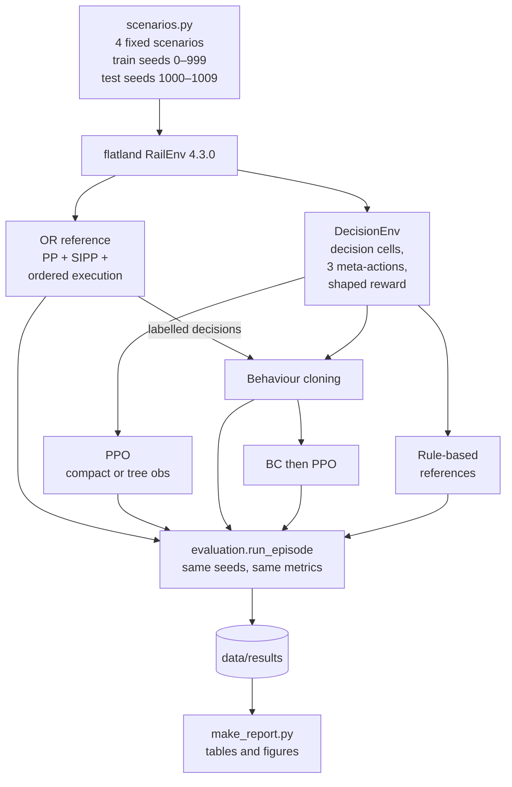
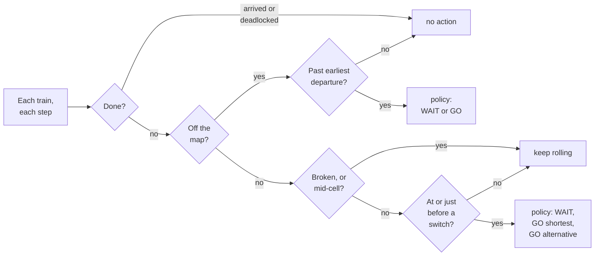
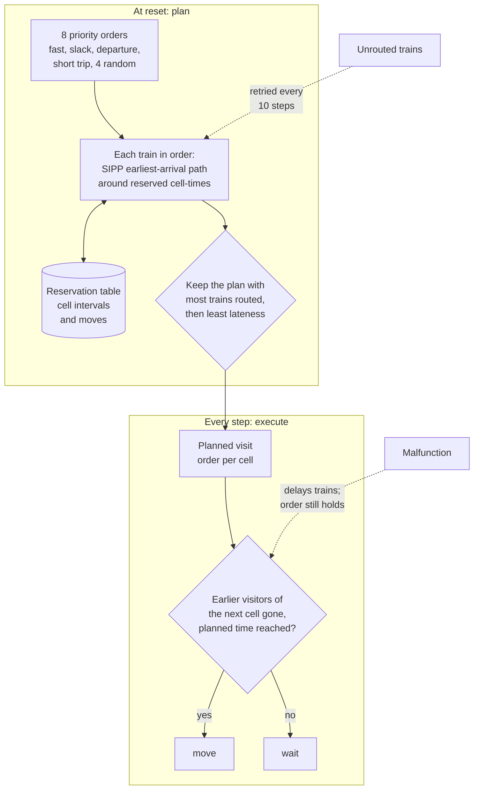
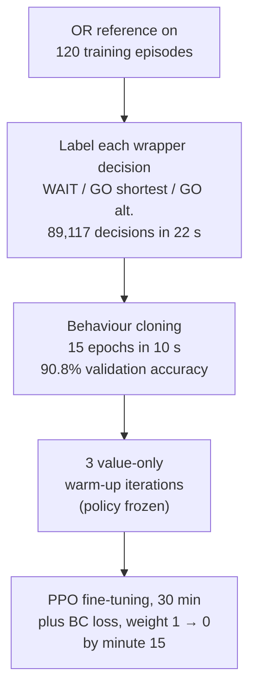

# :fl-results: Solution designs and results

This page compares the designs that produced the numbers in [Timeline](03-timeline.md), then the
baselines in this repository and how they perform on our mid-size scenarios.

## Published designs

"n/r" means not reported in any source we could open.

### Operations research and heuristics

| System | Core algorithm | What it sees | How it acts | Compute | Reported result |
|---|---|---|---|---|---|
| **Andreica, 2019 winner** ([arXiv:2111.07876](https://arxiv.org/abs/2111.07876); [interview](https://www.aicrowd.com/blogs/flatland-mugurel)) | Per-train shortest path in a time-expanded graph (cell, time), trains planned in priority order, fast trains first. After a malfunction, paths are updated to keep each cell's visiting order. | Full state | Native actions read off the timed paths | Rewritten from Python to C++ for speed | 99% of trains routed on average |
| **An_Old_Driver, NeurIPS 2020 winner** ([Li et al. 2021](https://ojs.aaai.org/index.php/ICAPS/article/download/15994/15805/19487)) | PP with SIPP; LNS (3 adaptive neighbourhoods, 4 parallel threads); MCP execution; partial replanning after malfunctions; lazy planning (plan some trains up front, the rest during execution); simulated annealing to split the time budget across test levels | Full state. The team skipped building flatland's own observation, which sped the simulator up by more than 6× on 556-train instances | Native actions from the plan, gated by MCP | 4 CPUs; evaluated on an AMD Opteron 63xx cloud instance with 64 GB | Score 297.507, 98.5% success on 362 instances; 3,256 trains solved in 704 s. Stage-by-stage: PP+A*+MCP 282.6 → SIPP 285.4 → +LNS 289.1 → +partial replanning 291.9 → +lazy planning 297.5 ([Laurent et al. 2021, §4.1](http://proceedings.mlr.press/v133/laurent21a/laurent21a.pdf)) |
| **An_Old_Driver, Flatland 3 winner** ([Chen et al. 2023](https://arxiv.org/abs/2306.06455)) | MAPF-LNS with slack-first priorities (ties: fast first), a delay-based LNS neighbourhood, partial replanning at fixed intervals (every T/20) | Full state | As above | AMD Opteron 63xx, 32 GB | 135.47 at close (145 of 150 instances). Each component: 123.966 → 124.227 (slack order) → 124.432 (delay neighbourhood) → 125.175 (periodic replanning) on their local benchmark |
| **v4-sipp-locks, ECML 2026 winner** ([repo](https://github.com/darshanmakwana412/ecml2026)) | Prioritized SIPP, tightest slack first; trains held off-map before departure; "overstay rights" (a train physically in a cell keeps it, and stale reservations are invalidated); directional locks on the 18 longest single-track corridors | Full state | Plan precomputed, re-planned on malfunction; avoids STOP actions (priced at 250 × speed by the ECML reward) | n/r | 20.8429, against 12.4925 for the runner-up ([results](https://flatland-association.github.io/flatland-book/challenges/ecml2026/post-competition_analysis.html)) |
| **Deadlock-avoidance heuristic** ([flatland-baselines](https://github.com/flatland-association/flatland-baselines)) | Follow shortest path; move only if enough free cells separate you from every opposing train on your path | Full state | Native | Trivial | 10.7320 in ECML 2026 |

*What each component was worth, from the winners' own ablations: the NeurIPS 2020 winner's competition score after each addition ([Laurent et al. 2021, §4.1](http://proceedings.mlr.press/v133/laurent21a/laurent21a.pdf)) and the Flatland 3 winner's score on its local 150-instance benchmark ([Chen et al. 2023](https://arxiv.org/abs/2306.06455)). Different benchmarks, so compare the steps, not the two panels.*

### Reinforcement learning

| System | Algorithm and network | Observation | Action design | Reward | Training | Reported result |
|---|---|---|---|---|---|---|
| **JBR_HSE, NeurIPS 2020 RL winner** ([Laurent et al. 2021, §4.2](http://proceedings.mlr.press/v133/laurent21a/laurent21a.pdf)) | PPO; actor and critic [256, 128]; self-attention over messages from neighbouring trains | Depth-3 tree plus agent features, including a random "handle" in [0, 1] as a priority | Native; a separate supervised classifier gates departures (threshold 0.92, decaying) | \(0.01\,\Delta d - 5\,\text{deadlock} + 10\,\text{arrival}\) | Small environments; hardware n/r | 214.150, 78.5% arrived; communication "by far the most impactful" change |
| **Netcetera, 2nd RL** ([§4.3](http://proceedings.mlr.press/v133/laurent21a/laurent21a.pdf)) | Ape-X DQN (RLlib), dueling | Depth-1 tree plus a global conflict graph; graph colouring sets priorities | Native | Shaped | Curriculum | 181.497, 88.1% arrived |
| **MARMot-Lab-NUS, 4th RL** ([§4.4](http://proceedings.mlr.press/v133/laurent21a/laurent21a.pdf)) | A3C on PRIMAL | 27 hand-built features | Decision-cell masking plus handcrafted "traffic lights" limiting entry to clusters of switches | Shaped | n/r | 127.912, 66.4% arrived |
| **Roost et al. 2020** ([arXiv:2004.13439](https://arxiv.org/html/2004.13439)) | A3C, FC(128-64-64) + LSTM(64) | Tree | Reduced decision space; 5 learned communication actions | Shaped | Curriculum | 2-train switch: 47% → 95% with communication |
| **Mohanty et al. 2020 baselines** ([arXiv:2012.05893](https://arxiv.org/abs/2012.05893)) | Ape-X, PPO, CCPPO, MARWIL (RLlib) | Tree; global density map | Native | Flatland 2020 reward | Imitation data from a 2019 OR solution | 25×25, 5 trains: PPO 81.33%, Ape-X + 25% imitation 86% test completion |
| **TreeLSTM** ([Jiang et al. 2023](https://arxiv.org/pdf/2210.12933)) | PPO; child-sum TreeLSTM over a deep path tree (depth > 10, built in C++), then 3 self-attention blocks across trains; value summed over trains | Per-train attributes plus deep tree | Native 5 actions | Shared across trains: env reward + arrival bonus + departure term − deadlock penalty, weights tuned per phase | 6-phase curriculum at 50 → 80 → 100 → 200 trains; one phase took 5 days; hardware n/r | 125.3 on the 15 Flatland 3 stages, 66.4% arrived |
| **MAMBA** ([Egorov & Shpilman 2022](https://arxiv.org/abs/2205.15023)) | Model-based: discrete world model (32×32 categorical latents) plus attention communication; PPO in imagination | Agent-local | Native | Env reward + JBR_HSE's shaping | 300k to 1.5M env steps | More sample-efficient than a JBR_HSE re-implementation at 5 and 10 trains |
| **Maze-Flatland** ([Castagna et al. 2026](https://arxiv.org/html/2605.10257v1)) | Two policies: departure scheduling {dispatch, wait} and routing {follow plan, alternative, stop}, both behaviour-cloned from a fixed-budget MCTS planner | Global and conflict features for departures; tree collapsed to the next decision point for routing | Hierarchical, masked | Arrival ratio, deadlock-free | Iterative BC on 10, 20 and 50-train scenarios; hardware n/r | Up to 80 trains: "nearly doubling" arrivals against Greedy, PP, Deadlock Avoidance and TreeLSTM; deadlocks ≤ 5% |
| **ECML 2026 organisers' RL baseline** ([repo](https://github.com/dynamik1703/ecml2026-starterkit)) | Masked PPO / rerank policy with a deadlock-avoidance fallback on dense station clusters | Custom lightweight builder | Masked | n/r | n/r | 9.4231 in ECML 2026 |

### What makes the OR entries strong

1. **They use the model.** The simulator is deterministic apart from malfunctions, and the
   planners exploit that fully: they reserve cell-time slots and know exactly when a train will
   arrive. An RL policy with a local tree observation has to infer, from a few features, what the
   planner reads off the reservation table.
2. **Deadlock-freedom by construction.** Order-preserving execution (MCP) turns "never deadlock"
   from something learned into a structural guarantee, even under malfunctions. Every OR winner
   has this in some form. JBR_HSE's departure classifier, MARMot's traffic lights and
   Maze-Flatland's dispatch policy are all attempts to recover it by other means.
3. **Anytime improvement within the clock.** LNS keeps improving a feasible plan for as long as the
   time budget allows, and the 2020 winner even optimised how to spend the budget across test
   levels. The score is a sum over episodes solved before an 8-hour or 2-hour limit, so speed turns
   directly into score.
4. **Good priorities.** Slack first and fast trains first are cheap and strong, and they are
   exactly the kind of decision a learned model could improve (see [06](06-open-questions.md)).

### What made the RL entries work at all

Every RL entry above that scored well used most of these: decision-cell masking or a reduced action
set; reward shaping on distance progress with deadlock penalties; an explicit mechanism for
departure timing (classifier, traffic lights, dispatch policy); some form of priority signal;
communication or attention across trains; a curriculum over the number of trains.

## Baselines in this repository

All code is in `src/rl_flatland/`. Every baseline runs through the same harness
(`evaluation.run_episode`), on the same four scenarios and the same 10 held-out seeds per scenario,
once without and once with malfunctions (see `data/scenarios/scenarios.json`).

### Environment wrapper and observations

- `scenarios.py` fixes four `sparse_rail_generator` scenarios (small 30×30/10 trains, medium
  50×50/30, large 80×80/60, xlarge 100×100/100) with the Flatland 3 mixed speed profile (a quarter
  each at 1, 1/2, 1/3, 1/4). Training uses seeds 0 to 999. Evaluation uses seeds 1000 to 1009 twice:
  without malfunctions and with them (rate 1/1000 per train-step, 20 to 50 steps). Switching
  malfunctions on does not change the network, lines or timetable of a seed.
- `env.DecisionEnv` asks a train for a decision only when it is ready to depart, at a facing
  switch, or on the cell before a switch. Elsewhere it keeps rolling. On the medium scenario that
  is 29% of rail configurations (notebook 01). The action set is WAIT / GO along the shortest
  branch / GO along the alternative branch, with the last masked where there is no alternative.
- `observations.CompactObs` (28 features): own state, speed, malfunction, remaining distance,
  timetable slack, time, and for each branch a 30-cell look-ahead giving distance to the nearest
  opposing train, number of opposing trains, distance to the train ahead, whether the next cell is
  occupied, whether the opposing train is broken down, and the length of the single-track stretch.
- `observations.TreeObs` (260 features): flatland's depth-2 `TreeObsForRailEnv` with a 20-step
  shortest-path predictor, flattened and normalised as in the 2020 starter kits, plus 8 own
  features.

How `DecisionEnv` treats each train on each step:

### OR reference: PP + SIPP + ordered execution

`baselines/or_planner.py`, written from the papers (no code copied). At reset it plans every train
off-map-to-target with SIPP on a reservation table that encodes flatland 4.3.0's exact conflict
model: one train per cell, no swaps, following allowed, k steps per cell for speed 1/k, and a
target cell held only in the arrival step. It tries 4 priority orders (fast first, slack first,
earliest departure, shortest trip) and 4 random ones, and keeps the plan that routes the most
trains, then the least lateness. During execution a train enters a cell only when every train
planned into that cell before it has left, never earlier than its planned time, and never while
broken down. A queue of trains may move up together, and so may a ring of three or more (flatland's
MotionCheck allows both). Trains that could not be planned are retried every 10 steps against the
current reservations.

This matches the "PP + SIPP + MCP" stage of the 2020 winner (285.4 of their final 297.5 in
[Laurent et al. 2021, §4.1](http://proceedings.mlr.press/v133/laurent21a/laurent21a.pdf)),
plus priority restarts. Not included: LNS, partial replanning after malfunctions, lazy planning.
It is plain Python, and still plans 100 trains in about 2 s.

### PPO with parameter sharing

`baselines/ppo.py`. One actor-critic, two tanh layers of 128 units (about 21k parameters with the compact
observation, 50k with the tree), shared by all trains. Each train is an independent trajectory in a semi-MDP: rewards between two of its
decisions are discounted inside the transition, and GAE uses \(\gamma^{\tau}\) and
\((\gamma\lambda)^{\tau}\) for the variable gap \(\tau\) (\(\gamma = 0.99\), \(\lambda = 0.95\)). Reward is JBR_HSE's shaping. Rollouts:
16 episodes per iteration on 8 worker processes, half small and half medium, half with
malfunctions. Then 4 epochs of clipped PPO (clip 0.2, entropy 0.01, lr 3e-4) on minibatches of 2048
decisions. Training stops after a 30-minute wall-clock budget. Evaluation is greedy.

#### Why a custom PPO trainer

Stable-Baselines3 assumes one agent per env step with a fixed step length. Here the set of trains
that must act changes every step, and each train's step length is variable. Wrapping that into
SB3's vectorised single-agent interface would need a padding scheme and would still get the
discounting wrong. The custom trainer is 250 lines and does the semi-MDP bookkeeping explicitly.

### Imitation, then PPO

`baselines/imitation.py`. The OR reference is run on 60 small and 60 medium training seeds (half
with malfunctions). At every decision point of the RL wrapper, the planner's action is labelled
in the same 3-action space: WAIT if it holds the train, otherwise the branch its planned next
cell lies on. Off-map WAIT labels are subsampled to 20%. A behaviour-cloning policy (BC) is trained
with cross-entropy for 15 epochs, then fine-tuned with PPO for 30 minutes (lr 1e-4, entropy 0.003,
3 value-only warm-up iterations). A BC loss on the demonstrations is added and annealed from
weight 1 to 0 by half-way. The demonstrations are committed in `data/demos/or_demos.npz`.

### Two rule-based references

- `ShortestPathPolicy`: everybody departs at once and follows their shortest path, with no
  coordination. It measures how much coordination matters.
- `ReactiveAvoidPolicy`: on the RL wrapper's decisions and compact features, go along the shortest
  branch if no opposing train is within 30 cells, else the alternative if it is clear, else wait.
  It measures how much the compact observation gives you without learning.

## Results on our scenarios

All numbers below come from [`data/results/`](https://github.com/leandergrech/rl-flatland-rescheduling/blob/main/data/results) (every episode is stored) and are
regenerated by `python scripts/make_report.py`. Each cell is the mean over the 10 held-out seeds
± standard error. The malfunction tables use the **same seeds** with malfunctions switched on
(rate 1/1000 per train-step, 20 to 50 steps), so the difference between the two isolates the
effect of malfunctions. Learned policies were trained on small and medium only.

*Share of trains arrived, mean over 10 held-out seeds with standard-error whiskers. The tables below give every number.*

<!-- RESULTS:START -->
### Arrival rate (%), held-out seeds, no malfunctions

| Policy | small | medium | large | xlarge |
|---|---|---|---|---|
| OR: PP+SIPP+ordered execution | 100.0 ± 0.0 | 99.3 ± 0.7 | 98.2 ± 0.9 | 95.7 ± 1.1 |
| PPO, compact obs | 60.0 ± 13.9 | 35.0 ± 8.7 | 14.3 ± 2.6 | 7.5 ± 1.5 |
| BC from OR | 39.0 ± 7.1 | 18.0 ± 4.3 | 13.0 ± 2.2 | 7.9 ± 0.8 |
| BC then PPO | 63.0 ± 12.4 | 23.7 ± 4.5 | 13.3 ± 1.7 | 6.4 ± 1.2 |
| PPO, tree obs | 25.0 ± 8.1 | 24.7 ± 4.8 | 16.5 ± 1.7 | 16.0 ± 1.5 |
| Reactive rule | 82.0 ± 9.4 | 46.3 ± 10.7 | 25.3 ± 4.3 | 11.1 ± 2.1 |
| Shortest path, no coordination | 36.0 ± 5.4 | 24.7 ± 4.7 | 8.3 ± 0.7 | 5.7 ± 1.0 |

### Normalised reward, held-out seeds, no malfunctions

| Policy | small | medium | large | xlarge |
|---|---|---|---|---|
| OR: PP+SIPP+ordered execution | 0.995 ± 0.004 | 0.991 ± 0.006 | 0.972 ± 0.010 | 0.953 ± 0.007 |
| PPO, compact obs | 0.810 ± 0.062 | 0.724 ± 0.043 | 0.626 ± 0.020 | 0.582 ± 0.015 |
| BC from OR | 0.734 ± 0.038 | 0.679 ± 0.026 | 0.658 ± 0.015 | 0.623 ± 0.010 |
| BC then PPO | 0.823 ± 0.058 | 0.700 ± 0.028 | 0.646 ± 0.013 | 0.614 ± 0.011 |
| PPO, tree obs | 0.664 ± 0.044 | 0.751 ± 0.020 | 0.744 ± 0.012 | 0.737 ± 0.013 |
| Reactive rule | 0.885 ± 0.041 | 0.766 ± 0.043 | 0.689 ± 0.024 | 0.615 ± 0.012 |
| Shortest path, no coordination | 0.728 ± 0.038 | 0.656 ± 0.030 | 0.564 ± 0.009 | 0.538 ± 0.012 |

### Deadlocked trains at episode end (mean per episode), held-out seeds, no malfunctions

| Policy | small | medium | large | xlarge |
|---|---|---|---|---|
| OR: PP+SIPP+ordered execution | 0.0 | 0.0 | 0.0 | 0.0 |
| PPO, compact obs | 0.0 | 0.9 | 2.4 | 7.6 |
| BC from OR | 1.1 | 5.8 | 13.7 | 24.6 |
| BC then PPO | 0.8 | 2.5 | 4.9 | 8.2 |
| PPO, tree obs | 0.0 | 0.2 | 0.2 | 1.0 |
| Reactive rule | 0.0 | 1.2 | 6.4 | 6.3 |
| Shortest path, no coordination | 3.6 | 17.9 | 30.7 | 61.7 |

### Arrival rate (%), same seeds with malfunctions

| Policy | small | medium | large | xlarge |
|---|---|---|---|---|
| OR: PP+SIPP+ordered execution | 100.0 ± 0.0 | 98.0 ± 1.4 | 93.8 ± 1.6 | 89.1 ± 2.2 |
| PPO, compact obs | 60.0 ± 13.9 | 36.0 ± 8.3 | 14.2 ± 3.3 | 7.5 ± 1.6 |
| BC from OR | 41.0 ± 7.1 | 19.7 ± 4.2 | 15.2 ± 2.8 | 8.2 ± 1.1 |
| BC then PPO | 61.0 ± 11.3 | 20.7 ± 3.6 | 15.3 ± 2.3 | 6.9 ± 1.6 |
| PPO, tree obs | 22.0 ± 7.7 | 22.7 ± 4.5 | 16.3 ± 1.6 | 15.0 ± 1.5 |
| Reactive rule | 76.0 ± 9.7 | 45.7 ± 9.7 | 22.3 ± 4.0 | 9.8 ± 1.3 |
| Shortest path, no coordination | 36.0 ± 5.4 | 23.7 ± 4.0 | 9.2 ± 0.7 | 5.2 ± 0.9 |

### Normalised reward, same seeds with malfunctions

| Policy | small | medium | large | xlarge |
|---|---|---|---|---|
| OR: PP+SIPP+ordered execution | 0.991 ± 0.004 | 0.984 ± 0.009 | 0.952 ± 0.013 | 0.922 ± 0.007 |
| PPO, compact obs | 0.804 ± 0.060 | 0.729 ± 0.041 | 0.633 ± 0.020 | 0.580 ± 0.015 |
| BC from OR | 0.741 ± 0.039 | 0.677 ± 0.025 | 0.660 ± 0.014 | 0.595 ± 0.009 |
| BC then PPO | 0.821 ± 0.051 | 0.676 ± 0.026 | 0.654 ± 0.016 | 0.611 ± 0.014 |
| PPO, tree obs | 0.656 ± 0.043 | 0.747 ± 0.019 | 0.742 ± 0.012 | 0.732 ± 0.014 |
| Reactive rule | 0.867 ± 0.040 | 0.761 ± 0.038 | 0.679 ± 0.024 | 0.612 ± 0.010 |
| Shortest path, no coordination | 0.727 ± 0.038 | 0.649 ± 0.026 | 0.570 ± 0.010 | 0.537 ± 0.013 |

### Deadlocked trains at episode end (mean per episode), same seeds with malfunctions

| Policy | small | medium | large | xlarge |
|---|---|---|---|---|
| OR: PP+SIPP+ordered execution | 0.0 | 0.0 | 0.0 | 0.0 |
| PPO, compact obs | 0.0 | 0.9 | 2.0 | 7.8 |
| BC from OR | 1.1 | 5.9 | 15.4 | 30.9 |
| BC then PPO | 1.0 | 2.4 | 4.3 | 8.0 |
| PPO, tree obs | 0.0 | 0.2 | 0.5 | 1.4 |
| Reactive rule | 0.0 | 1.0 | 5.5 | 6.1 |
| Shortest path, no coordination | 3.6 | 16.6 | 33.5 | 61.4 |

### Policy wall-clock per env step (ms, mean over episodes, no malfunctions)

| Policy | small | medium | large | xlarge |
|---|---|---|---|---|
| OR: PP+SIPP+ordered execution | 0.05 | 0.17 | 0.45 | 1.27 |
| PPO, compact obs | 5.96 | 11.31 | 15.90 | 32.28 |
| BC from OR | 0.66 | 2.00 | 2.88 | 23.16 |
| BC then PPO | 0.84 | 2.27 | 3.54 | 5.86 |
| PPO, tree obs | 2.56 | 11.34 | 16.22 | 16.01 |
| Reactive rule | 3.14 | 8.65 | 11.89 | 4.06 |
| Shortest path, no coordination | 0.06 | 0.13 | 0.27 | 0.45 |

### One-off setup per episode (s; the OR planner's initial plan)

| Policy | small | medium | large | xlarge |
|---|---|---|---|---|
| OR: PP+SIPP+ordered execution | 0.05 | 0.54 | 2.73 | 7.05 |
| PPO, compact obs | 0.00 | 0.00 | 0.00 | 0.00 |
| BC from OR | 0.00 | 0.00 | 0.00 | 0.00 |
| BC then PPO | 0.00 | 0.00 | 0.00 | 0.00 |
| PPO, tree obs | 0.00 | 0.00 | 0.00 | 0.00 |
| Reactive rule | 0.00 | 0.00 | 0.00 | 0.00 |
| Shortest path, no coordination | 0.03 | 0.17 | 0.43 | 0.61 |

<!-- RESULTS:END -->

*The no-malfunction tables above as charts. Policy time is on a log scale.*

Wall-clock numbers were measured with 8 worker processes on a ThinkPad i7-1260P while two unrelated
training jobs shared the CPU (1-minute load average median 23, range 11 to 44, logged in
[`data/results/run_log/`](https://github.com/leandergrech/rl-flatland-rescheduling/blob/main/data/results/run_log)). Treat them as upper bounds for a dedicated
laptop and compare them within a column, not in absolute terms. The per-step time of PPO (tree obs)
excludes building the tree, which flatland does inside `env.step`: with the tree builder the env
step averages 7 ms on small and 150 ms on xlarge, against 4 and 20 ms for compact PPO.

### Training budgets

| Baseline | Training wall-clock | Iterations × episodes | Env steps | Train-level decisions | Evaluation |
|---|---|---|---|---|---|
| PPO (compact obs) | 30.3 min | 141 × 16 = 2,256 | 857,609 | 5.4 M | 6.7 min |
| BC from OR | 0.5 min (22 s demos, 10 s cloning) | 120 OR episodes, 89,117 labelled decisions | – | – | 2.7 min |
| BC then PPO | 31.2 min including the BC stage | 133 × 16 = 2,128 | 838,525 | 7.2 M | 1.4 min |
| PPO (tree obs) | 31.3 min | 52 × 16 = 832 | 295,719 | 0.65 M | 22.0 min |
| OR reference | none | – | – | – | 1.1 min |

Every baseline trains and evaluates end to end in under an hour. The slowest is PPO (tree obs) at
53.3 minutes.

*The budget table as a chart: training (solid) plus evaluation on the 80-episode suite (hatched).*

*Training episodes use sampled actions on small and medium maps (half with malfunctions), so these are not test numbers. Five-iteration moving average.*

### What the numbers say

1. **The OR reference is close to perfect at this scale, and never deadlocks.** It gets 100% of
   trains home on small, 99.3% on medium, 98.2% on large and 95.7% on xlarge, with zero deadlocked
   trains in all 80 episodes. It spends 0.05 to 7 s planning once, then 0.05 to 1.3 ms per step.
   Malfunctions cost it 0, 1.3, 4.3 and 6.6 points of arrival rate on the four scenarios. That
   loss grows with density, which is the knock-on effect of order-preserving execution.
2. **Every learned baseline is far behind, and mostly behind a ten-line rule.** The best learned
   arrival rate is 63.0% on small (BC then PPO), 35.0% on medium (PPO), 16.5% on large and 16.0% on
   xlarge (PPO, tree obs), against 100, 99.3, 98.2 and 95.7% for OR. The reactive heuristic on the
   same compact features beats every learned policy on small, medium and large (82.0, 46.3, 25.3%).
   The gap is larger than the competitions' 20 points because the training budget is 30 CPU minutes,
   not days.
3. **PPO learned to stop deadlocking, then gridlocked.** Training deadlocks fell from about 80% of
   trains to under 5% within 20 minutes. But on 4 medium held-out seeds, 79 of the 86 trains that
   did not arrive were still on the map at the horizon, waiting at switches for trains that were
   waiting for them, while only 4 were in true head-on deadlocks. On large, 162 of 206 were stuck
   the same way and 44 never departed. Avoiding the absorbing failure is learnable in 30 minutes;
   deciding who goes first is not, without a priority signal or communication.
4. **Cloning the planner copies its actions but not its reasons.** BC predicts the planner's
   decision 90.8% of the time on held-out demonstrations, yet delivers only 39.0% of trains on small
   and walks into deadlocks the planner never has (5.8 trains per medium episode, 24.6 on xlarge).
   The planner waits because of reservations for trains that are not yet in view, and the compact
   observation cannot show that. PPO fine-tuning lifts small to 63.0% and cuts deadlocks about
   3×, but the BC regulariser held it at about 20% training arrival until its weight reached zero at
   minute 15. After that it climbed to about 50%, still below PPO from scratch.
5. **The tree observation is slower to learn from but generalises better.** With a quarter of the
   updates (52 iterations against 141, because the tree is expensive to build) PPO on the tree
   observation is worse on small (25.0%) but the best learned policy on large and xlarge (16.5 and
   16.0%), with almost no deadlocks (at most 1.4 trains per episode) and the best normalised reward
   of any learned policy from medium up (0.751 to 0.737). The low deadlock count has a cost: it
   never dispatches 67 to 69% of trains from medium up (see the failure-mode breakdown in
   [Limitations](05-limitations.md#where-the-trains-that-do-not-arrive-end-up)).
6. **Malfunctions barely move the learned policies** (at most 6 points either way), because they
   fail for other reasons first. Malfunction robustness only becomes a meaningful comparison once a
   learned policy gets most trains home.

### What longer training would likely change

The compact PPO curve flattened at about 55 to 60% training arrival after 18 minutes. The
tree-observation run's training arrival plateaued at 30 to 37% from minute 12, but its training
deadlock fraction was still falling (from 81% to 46% of trains) when the budget ran out, on only 832
episodes. More compute would most likely help tree-obs PPO the most, and would bring compact PPO on
small and medium up towards the reactive heuristic. The
literature suggests the ceiling without structural changes is well below OR. TreeLSTM needed a
6-phase curriculum, 5 days of training for one phase, deep trees and cross-train attention to reach
66.4% on the Flatland 3 stages
([Jiang et al. 2023](https://arxiv.org/pdf/2210.12933)). The failure modes above (gridlock,
departure timing, missing information about trains out of view) are what JBR_HSE's departure
classifier and communication, and Maze-Flatland's separate dispatch policy, were built to address.
Longer training alone does not add those.
