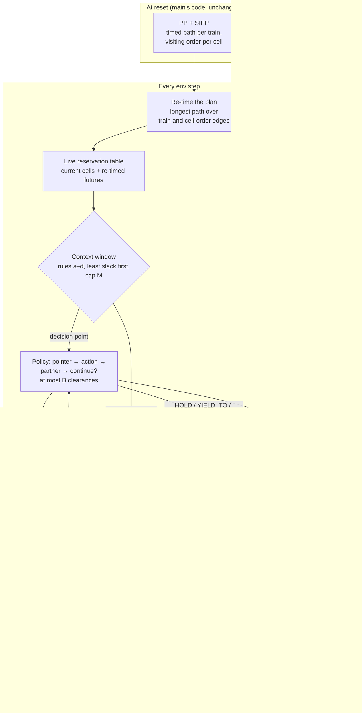

# 8. TADA on rails: a windowed dispatcher on top of the planner

This page describes an experiment on the `feat/tada-dispatcher` branch. It puts a small learned
dispatcher on top of the OR reference. The planner keeps doing what it is good at: timed,
collision-free paths for every train. The policy only decides, at a few trains per step, whether
to depart from that plan. The structure is taken from TADA, Leander's single-agent air-traffic
control project. Every number on this page comes from a run of the scripts listed under
[Reproduce](#reproduce), and the data files are linked next to each table.

<!-- TADA_SUMMARY:START -->
!!! abstract "In one paragraph"
    The executor under the dispatcher reproduces main's OR reference exactly on all 80 held-out
    episodes, and no edit it offers has ever produced a deadlock or a reservation violation
    (28,705 random edits in step 1; 0 terminations in 221 evaluation episodes and
    continuous runs). The learned dispatcher, trained for 55 minutes on medium, ties the executor
    there: 99.3% / 98.3% arrival without / with malfunctions against
    99.3% / 98.0%, and far above main's best learned policy (35% / 36%). Transferred to
    xlarge with malfunctions it gains 9 trains and loses 4 over 10 seeds; in the continuous variant
    it matches the executor at every injection rate, and neither deadlocks. 5 ablations are below.
    The structure works as a safe interface for learning; within this compute budget the learning
    on top of it adds almost nothing, and the reasons are listed under
    [What did not work](#what-did-not-work).
<!-- TADA_SUMMARY:END -->

## The analogy

TADA realises a predetermined landing sequence (the arrival manager, AMAN) under disturbances. The
environment keeps a context window of aircraft that may receive a clearance, the policy picks an
aircraft, then a clearance, then whether to issue another one, and masks keep it from exploring
anything unsafe or ill-timed. Flatland maps onto that almost one to one:

| TADA (air traffic control) | Flatland here | Code |
|---|---|---|
| AMAN landing sequence | OR plan: a timed path per train and a visiting order per cell (PP + SIPP) | `PrioritizedPlannerPolicy` in `baselines/or_planner.py` (main) |
| Aircraft follow their flight plan | PROCEED: every train follows its plan by ordered execution | `TadaExecutor.act` (inherited unchanged) |
| Separation minima, safety net | Live cell-time reservation table; no head-on or swap can be planned | `TadaExecutor.table`, `TrainTable` |
| Context window of controllable aircraft | Up to M trains chosen by rules (a) to (d) below, least slack first | `tada/window.py: build_window` |
| Clearances (heading, speed, level) | HOLD, YIELD_TO a partner, REROUTE at the next facing switch | `TadaExecutor.plan_clearance` |
| Clearance only at the right moment | Only at a decision instant: a cell exit, or ready to depart | `TadaExecutor.at_decision` |
| Aircraft-choice and action masks | Choosable mask; exact action masks from speculative SIPP plans | `DispatchEnv.action_mask` |
| At most 2 clearances per step | Budget B = 2, continue head | `policy.act_at_point` |
| High-severity infringement ends the episode | Termination: deadlock or reservation violation | `DispatchEnv._deadlock` |
| Timeout | Truncation at the horizon T, with bootstrap | `DispatchEnv._env_step` |
| AMAN is fixed (TADA's main limitation) | The plan is re-timed every step, and edited tails are replanned with SIPP | `TadaExecutor.retime`, `commit` |

One difference works in our favour. TADA's AMAN could not be recomputed, which capped what the
policy could fix. Here every clearance replans the affected trains' tails in milliseconds, so the
learned layer only owns the deviations from the plan.

## Architecture



### Executor

`TadaExecutor` subclasses main's planner and changes nothing about how a plan is followed. With
every clearance set to PROCEED it runs main's code path step for step (verified below). What it
adds:

- **Re-timing.** A malfunction does not make an ordered plan infeasible, only late. Every step the
  executor computes, for every future visit, the earliest time consistent with the planned time,
  where the train is now (dwell and malfunction included), and the visiting order of every cell.
  That is a longest-path computation over two kinds of edges: a train's consecutive visits (+k steps
  per cell) and consecutive visitors of one cell (the next enters when the previous one leaves).
  Main's plans contain zero-delay rotation cycles (three or more trains moving round a loop in one
  step, which flatland allows), so it is solved by relaxation rather than a topological sort.
- **Live reservation table.** Every train's current cell and re-timed future are reserved. Edits are
  searched against this table, never against the original planned times: a late train's stale
  intervals would look free, and an edit could be scheduled head-on against it.
- **Clearances.** HOLD replans the train to leave its cell (or depart) no earlier than 5 steps later
  than it could. YIELD_TO plans the partner first and then the train, which swaps their order on
  the shared cells. REROUTE forbids the planned branch at the next facing switch within D decision
  instants. Each is a speculative SIPP search from where the trains stand; if any search fails, the
  table is left exactly as it was and the action is masked.
- **Commit.** New tails are spliced into the visit lists, every plan is re-timed, and the table is
  rebuilt. The visiting order stays a consistent collision-free schedule, so ordered execution
  stays deadlock-free.

### Context window

All rules are evaluated on the re-timed schedule. A train enters the window if:

- **(a) conflict:** within the next H steps it directly precedes or follows another train in some
  cell's visiting order;
- **(b) plan infeasible:** its projected arrival is later than its latest arrival LA, or beyond
  the horizon;
- **(c) approach:** another train uses, within H, a cell on its path up to its D-th decision cell
  (a diverging switch, or the cell just before any switch) or the segment after it;
- **(d) departure:** it is ready to depart and its first segment is occupied now or reserved
  within H.

Members are ranked by slack `LA - (t + k * remaining cells)`, least first, and capped at M
(defaults H = 30, D = 3, M = 8).

Each member is a vector of 14 numbers:
- slack and speed;
- steps to its next decision cell and distance to target;
- how many trains directly precede and follow it in shared cells within H, and the least slack
  among them;
- malfunction steps left;
- plan-feasible and off-map flags;
- projected delay against LA;
- at-decision flag;
- lag behind the original plan;
- whether rule (b) admitted it.

Feature set (ii) adds six numbers for each of up to three branches ahead: whether the branch
exists, its extra distance to target, the distance to and number of opposing trains, the distance to
the next same-direction train, and whether its first cell is occupied. These come from the branch
scan in main's compact observation (`_scan_branch`), a cheap stand-in for flatland's tree
observation. A train is choosable only if it is at a decision instant and
has a legal action other than PROCEED.

### Policy and training

A one-layer transformer encoder (d = 64, 4 heads) reads the window plus a global token. The empty
window is valid. Per clearance it chooses a train (pointer), an action (masked), a partner for
YIELD_TO (a second pointer, masked to the partners whose swap plans succeed), and whether to
continue, with the environment capping the sequence at B. The joint log-probability is the sum
over the sequence. Training is PPO on decision points as a semi-MDP: the reward between two
decision points is discounted per env step, and the bootstrap is cut only on termination.

The reward is main's: `DefaultRewards` summed over trains and scaled by 100 / (N T), so an episode's
return is 100 times (normalised reward - 1). Flatland charges a train that misses its target only
at the horizon. On termination, every unfinished train is charged that penalty as if it stayed put
until T, so ending an episode early can never score better than running it out.

## Step 1: the executor reproduces main exactly

<!-- TADA_VERIFY:START -->
With every clearance forced to PROCEED, the dispatch loop (window, masks, re-timing, termination
checks) must leave main's OR reference untouched. Over all 80 held-out episodes it is compared with
the stored results ([or.json](https://github.com/leandergrech/rl-flatland-rescheduling/blob/feat/tada-dispatcher/data/results/or.json)) on arrived trains, deadlocked trains,
episode length and normalised reward (to 1e-9).
**80 of 80 episodes are identical, with 0 mismatching fields**
([verify.json](https://github.com/leandergrech/rl-flatland-rescheduling/blob/feat/tada-dispatcher/data/tada/verify.json), commit `5c667ed`).

| Scenario | Malfunctions | Episodes | Arrived (executor) | Arrived (main's OR) | Identical (arrived, deadlocked, steps, normalised reward) | Terminated | Rotation flags |
|---|---|---|---|---|---|---|---|
| small | off | 10 | 100 | 100 | 10/10 | 0 | 0 |
| small | on | 10 | 100 | 100 | 10/10 | 0 | 0 |
| medium | off | 10 | 298 | 298 | 10/10 | 0 | 0 |
| medium | on | 10 | 294 | 294 | 10/10 | 0 | 0 |
| large | off | 10 | 589 | 589 | 10/10 | 0 | 3 |
| large | on | 10 | 563 | 563 | 10/10 | 0 | 2 |
| xlarge | off | 10 | 957 | 957 | 10/10 | 0 | 17 |
| xlarge | on | 10 | 891 | 891 | 10/10 | 0 | 16 |

"Rotation flags" counts steps at which main's `find_deadlocked` flagged a ring of trains that the
plan rotates through a block of switches in one step (see [What did not work](#what-did-not-work)).

The second check drives the dispatcher with a random policy: at every decision point it picks
random choosable trains and, half the time, a random legal clearance (up to B = 2), on
200 episodes (small and medium, half with malfunctions, seeds 3000 to 3199).
That committed **28,705 plan edits** (144 per episode).
**0 episodes** showed a deadlock, a reservation violation or a train leaving its plan.
Arrival under random edits was 98.7% on small and
98.5% on medium, against
100.0% and 98.7% for the
executor alone on the held-out seeds (different seeds, so only indicative): random edits are safe but not free.
<!-- TADA_VERIFY:END -->

## Step 2: window occupancy

<!-- TADA_OCCUPANCY:START -->


*Executor alone (every clearance PROCEED), the 10 malfunction-free held-out episodes per scenario,
one sample per env step. Source: [occupancy_proceed_only.json](https://github.com/leandergrech/rl-flatland-rescheduling/blob/feat/tada-dispatcher/data/tada/occupancy_proceed_only.json), written by `scripts/tada_verify.py`.*

| Scenario | Mean trains in window | Steps with the window full (M = 8) | Steps with an empty window |
|---|---|---|---|
| small | 5.92 | 47% | 7% |
| medium | 6.62 | 71% | 5% |
| large | 7.27 | 86% | 1% |
| xlarge | 7.48 | 90% | 2% |

The window never exceeds M by construction, and every train in it has a legal action (both are
asserted in `tests/test_tada.py`). On medium and larger maps the window is full for much of the
episode, so ranking by slack is doing real selection there.
<!-- TADA_OCCUPANCY:END -->

## Results on medium

<!-- TADA_MEDIUM:START -->
Medium (50×50, 30 trains), 10 held-out seeds (1000 to 1009), each with malfunctions off and on,
greedy policy. Arrival is mean ± standard error over seeds. Terminations and truncations are summed
over the 20 episodes. Wall-clock per step covers everything: window, masks, policy, plan edits and
the env step.

| Controller | Arrival, no malf. (%) | Arrival, malf. (%) | Norm. reward, no malf. | Norm. reward, malf. | Terminations | Truncations | Wall-clock per step (ms) |
|---|---|---|---|---|---|---|---|
| Executor only (main's OR, every clearance PROCEED) | 99.3 ± 0.7 | 98.0 ± 1.4 | 0.991 | 0.984 | 0 | 20 | 8.5 |
| Learned dispatcher (TADA on rails) | 99.3 ± 0.7 | 98.3 ± 1.0 | 0.990 | 0.984 | 0 | 20 | 11.0 |
| main's best learned baseline (PPO, compact obs.) | 35.0 ± 8.7 | 36.0 ± 8.3 | 0.724 | 0.729 | – | – | – |

Sources: [executor.json](https://github.com/leandergrech/rl-flatland-rescheduling/blob/feat/tada-dispatcher/data/tada/results/executor.json), [main.json](https://github.com/leandergrech/rl-flatland-rescheduling/blob/feat/tada-dispatcher/data/tada/results/main.json) (`scripts/tada_evaluate.py`),
main's PPO from [ppo.json](https://github.com/leandergrech/rl-flatland-rescheduling/blob/feat/tada-dispatcher/data/results/ppo.json).

Paired by seed against the executor: without malfunctions, 0 seeds gain a train and 0 lose one (net +0 of 300), normalised reward -0.0007 ± 0.0005; with malfunctions, 2 seeds gain a train and 1 lose one (net +1 of 300), normalised reward +0.0009 ± 0.0014. On held-out medium the learned layer
is indistinguishable from the plan it sits on.

On the training maps the comparison has more headroom: they are harder than the held-out seeds (the
executor delivers 95.9% on the 606 distinct maps the run drew,
[executor_train_seeds.json](https://github.com/leandergrech/rl-flatland-rescheduling/blob/feat/tada-dispatcher/data/tada/results/executor_train_seeds.json)). Paired with the executor on the
same eight maps per iteration, the stochastic training policy scored +0.84 ± 0.10 points of arrival and -0.0015 ± 0.0004 normalised reward over all
115 iterations (79 iterations ahead on arrival). Split by phase: iterations 1–20 +0.79 ± 0.19 points of arrival and -0.0037 ± 0.0008 normalised reward;
iterations 61–115 +0.82 ± 0.15 points of arrival and -0.0005 ± 0.0004 normalised reward. The arrival gain is present from the first iterations, so it
comes from issuing edits at all, not from learning which ones; what training changed is the delay those
edits cost, which shrank to about zero.


Training: 115 PPO iterations of 8 medium episodes with malfunctions
(529,521 env steps) in 55 minutes on 8 worker processes,
CPU clock 400 to 2901 MHz across iterations (median 1664).
Log: [train_log.jsonl](https://github.com/leandergrech/rl-flatland-rescheduling/blob/feat/tada-dispatcher/data/tada/checkpoints/main/train_log.jsonl). Clearances issued by the greedy policy on the 20 evaluation
episodes: PROCEED 97.5%, HOLD 2.4%, YIELD_TO 0.1%, REROUTE 0.0%.


<!-- TADA_MEDIUM:END -->

## Ablations

<!-- TADA_ABLATIONS:START -->
Every ablation trains for 60 iterations of 8 medium episodes with malfunctions (half the main run's
budget, so the grid fits), with a 55-minute wall-clock cap. The baseline row is the main run's own
checkpoint after 60 iterations, so every row has seen the same number of episodes. All rows are
evaluated like the main run (10 seeds × malfunctions off/on, greedy). "Iterations done" shows where
the cap cut a run short.

| Run | Change | Arrival, no malf. (%) | Arrival, malf. (%) | Trains gained / lost vs executor, malf. | Norm. reward, no malf. | Norm. reward, malf. | Terminations | Truncations | Edits per episode | Wall-clock per step (ms) | Iterations done | Training (min) |
|---|---|---|---|---|---|---|---|---|---|---|---|---|
| executor | every clearance PROCEED (no learning) | 99.3 ± 0.7 | 98.0 ± 1.4 | – | 0.9909 | 0.9836 | 0 | 20 | 0 | 8.5 | – | – |
| `main_it60` | main run at 60 iterations: B = 2, M = 8, set (i), all actions | 99.3 ± 0.7 | 98.3 ± 1.1 | +1 / -0 | 0.9909 | 0.9831 | 0 | 20 | 4.8 | 11.5 | 60/60 | 35 |
| `B1` | B = 1 | 99.3 ± 0.7 | 98.7 ± 1.0 | +2 / -0 | 0.9909 | 0.9857 | 0 | 20 | 1.0 | 14.8 | 60/60 | 29 |
| `B4` | B = 4 | 99.3 ± 0.7 | 98.3 ± 1.1 | +1 / -0 | 0.9908 | 0.9834 | 0 | 20 | 14.2 | 11.1 | 60/60 | 22 |
| `noyield` | YIELD_TO disabled | 99.3 ± 0.7 | 98.0 ± 1.4 | +0 / -0 | 0.9909 | 0.9830 | 0 | 20 | 9.4 | 13.0 | 60/60 | 29 |
| `M4` | M = 4 | 99.3 ± 0.7 | 98.3 ± 1.1 | +1 / -0 | 0.9909 | 0.9837 | 0 | 20 | 2.6 | 11.6 | 60/60 | 15 |
| `M16` | M = 16 | 99.3 ± 0.7 | 98.3 ± 1.1 | +1 / -0 | 0.9906 | 0.9839 | 0 | 20 | 3.6 | 11.7 | 60/60 | 22 |

Sources: `data/tada/results/<run>.json` and `data/tada/checkpoints/<run>/` for each run; executor row from
[executor.json](https://github.com/leandergrech/rl-flatland-rescheduling/blob/feat/tada-dispatcher/data/tada/results/executor.json).


*The y-axis starts at 90%.*

No setting separates from the executor or from the others. Without malfunctions every run delivers
exactly the executor's trains. With malfunctions the net difference to the executor ranges from
+0 to +2 trains out of 300. Almost all of it is one train on one map: seed 1005 with malfunctions, where the executor delivers 26 of 30, is recovered by 5 of the 6 trained runs (`main_it60`, `B1`, `B4`, `M4`, `M16`). That is a real, repeatable repair, and also the whole of the effect. The ablations
do change how much the policy edits (from 1.0 to
14.2 edits per episode), and none of them
ever terminated an episode. On this scenario, budget, window size, shaping, features and YIELD_TO do
not matter, because there is almost nothing left to gain.
<!-- TADA_ABLATIONS:END -->

## Generalisation without retraining

<!-- TADA_GENERAL:START -->
The policy trained on medium, evaluated without retraining on the other three scenarios (10
held-out seeds each, malfunctions off and on). The executor columns are the PROCEED-only runs from
step 1.

| Scenario | Malfunctions | Executor arrival (%) | Learned arrival (%) | Trains gained / lost (paired seeds) | Norm. reward, executor | Norm. reward, learned | Edits per episode | Terminations | Truncations | Wall-clock per step (ms) |
|---|---|---|---|---|---|---|---|---|---|---|
| small | off | 100.0 ± 0.0 | 100.0 ± 0.0 | +0 / -0 | 0.9948 | 0.9937 | 2 | 0 | 10 | 5 |
| small | on | 100.0 ± 0.0 | 100.0 ± 0.0 | +0 / -0 | 0.9906 | 0.9880 | 4 | 0 | 10 | 4 |
| large | off | 98.2 ± 0.9 | 98.2 ± 0.9 | +0 / -0 | 0.9716 | 0.9707 | 51 | 0 | 10 | 97 |
| large | on | 93.8 ± 1.6 | 94.0 ± 1.7 | +2 / -1 | 0.9521 | 0.9508 | 140 | 0 | 10 | 46 |
| xlarge | off | 95.7 ± 1.1 | 95.7 ± 1.1 | +0 / -0 | 0.9532 | 0.9524 | 102 | 0 | 10 | 139 |
| xlarge | on | 89.1 ± 2.2 | 89.6 ± 2.1 | +9 / -4 | 0.9219 | 0.9219 | 395 | 0 | 10 | 205 |

Sources: [main_general.json](https://github.com/leandergrech/rl-flatland-rescheduling/blob/feat/tada-dispatcher/data/tada/results/main_general.json), [verify.json](https://github.com/leandergrech/rl-flatland-rescheduling/blob/feat/tada-dispatcher/data/tada/verify.json).

Without malfunctions the learned layer changes nothing that matters on any map: it edits plans
but never gains or loses a train. With malfunctions it gains a few trains on the larger maps, where
the executor loses the most, at unchanged normalised reward: the trains it saves arrive late. The
edit count grows with map size and malfunctions, which is where the window is full most of the time.
Wall-clock per step here mixes runs at 400 MHz and 2.5 GHz (the evaluation shared the CPU with
ablation training), so compare it only within a row.
<!-- TADA_GENERAL:END -->

## Continuous Flatland

<!-- TADA_CONTINUOUS:START -->
One medium map (seed 5000), a pool of 400 trains whose earliest departures follow a Poisson process at
the given rate, latest arrival = injection + ceil(1.3 τ + 0.2 τ̄) (Flatland 3's allowance), malfunctions
on, truncated at 1000 steps; 3 arrival seeds per rate. Both controllers plan a train only once
it appears (`OnlineExecutor`). Delay is measured on trains that arrived, so at high rates it understates
the delay of the backlog, which is reported separately.

| Rate (trains/step) | Controller | Injected | Throughput (arrivals/1000 steps) | Mean delay vs LA (steps) | On time (%) | Waiting off-map at end | Deadlock terminations | Mean window occupancy | Wall-clock per step (ms) |
|---|---|---|---|---|---|---|---|---|---|
| 0.02 | executor | 19 | 16.0 | 1.1 | 96 | 0 | 0/3 | 1.18 | 11 |
| 0.02 | learned | 19 | 16.0 | 1.1 | 96 | 0 | 0/3 | 1.18 | 9 |
| 0.05 | executor | 45 | 38.3 | 0.2 | 97 | 0 | 0/3 | 3.75 | 10 |
| 0.05 | learned | 45 | 38.3 | 0.2 | 97 | 0 | 0/3 | 3.75 | 13 |
| 0.1 | executor | 97 | 77.7 | 10.1 | 77 | 1 | 0/3 | 7.24 | 14 |
| 0.1 | learned | 97 | 77.0 | 9.5 | 78 | 0 | 0/3 | 7.24 | 20 |
| 0.15 | executor | 142 | 112.0 | 32.7 | 46 | 3 | 0/3 | 7.71 | 19 |
| 0.15 | learned | 142 | 109.0 | 34.0 | 43 | 5 | 0/3 | 7.71 | 32 |
| 0.2 | executor | 189 | 120.0 | 100.7 | 27 | 33 | 0/3 | 7.79 | 30 |
| 0.2 | learned | 189 | 118.7 | 97.6 | 27 | 30 | 0/3 | 7.79 | 182 |
| 0.3 | executor | 298 | 144.3 | 140.2 | 21 | 106 | 0/3 | 7.85 | 76 |
| 0.3 | learned | 298 | 144.3 | 144.5 | 22 | 113 | 0/3 | 7.85 | 385 |
| 0.4 | executor | 388 | 139.7 | 196.7 | 18 | 202 | 0/3 | 7.89 | 452 |
| 0.4 | learned | 388 | 142.0 | 194.7 | 18 | 200 | 0/3 | 7.89 | 716 |

Sources: [continuous_executor.json](https://github.com/leandergrech/rl-flatland-rescheduling/blob/feat/tada-dispatcher/data/tada/results/continuous_executor.json), [continuous_learned.json](https://github.com/leandergrech/rl-flatland-rescheduling/blob/feat/tada-dispatcher/data/tada/results/continuous_learned.json) (`scripts/tada_continuous.py`).


Neither controller ever deadlocked (0 terminations in 42 runs): both break by running out of capacity, not by locking up. The executor drops below half of its trains on time at rate 0.15, starts queueing more than 10 trains off-map at 0.2, and peaks at 144 arrivals per 1000 steps; the learned dispatcher drops below half of its trains on time at rate 0.15, starts queueing more than 10 trains off-map at 0.2, and peaks at 144 arrivals per 1000 steps. The learned layer issues 680 plan edits per run at rate 0.4 and none below 0.1, without moving throughput or delay beyond the seed-to-seed spread; it does cost wall-clock, because at high rates the window is always full and every candidate edit is a SIPP search through a dense table.
<!-- TADA_CONTINUOUS:END -->

## What did not work

<!-- TADA_FAILED:START -->
**Main's deadlock detector flags rotations the plan relies on.** `find_deadlocked` treats two trains
that sit in each other's successor cells as a head-on pair. In a 2×2 block of switches, a ring of
four trains can be in exactly that position while the plan rotates them one cell each in a single
step, which flatland allows. With termination on every flag, 12 of the 80 executor-only
episodes (large, xlarge) would have ended at their first flag, and step 1 could
not pass. The dispatcher now follows each flagged train's planned next cell and terminates only if
that chain closes in a swap or reaches a train with no plan; the 38 flagged steps
are logged instead. Main's detector is unchanged and still right where it was used: at the end of
an episode.

**Early termination was rewarded.** Flatland charges a train for missing its target only at the
horizon, so an episode cut short by a termination skipped every penalty. The first episode that hit
one (a false rotation flag, before the fix above) ended early with most trains still out and a
perfect normalised reward, a better score than running it out. Termination now charges every
unfinished train its horizon penalty, as if it stayed put until T.

**A YIELD_TO bug that only the re-timing caught.** YIELD_TO replans two trains in sequence. The
first was lifted out of the table, current cell included, and only its new future put back, so the
second could be routed head-on through the first train's cell. Nothing failed at plan time; the
next re-timing found a positive cycle in the visiting order and raised. The executor now reserves the
first train's current cell while the second is planned, and the 200 random-clearance episodes in
step 1 exercise exactly this path.

**The entropy bonus outweighed the signal.** With coefficient 0.01 on the summed entropy of the
autoregressive heads, entropy rose from 1.77 to 2.08 in 32 iterations and plan
edits per episode from 31 to 152, while reward did not improve. That run was
stopped and kept ([log](https://github.com/leandergrech/rl-flatland-rescheduling/blob/feat/tada-dispatcher/data/tada/checkpoints/main_ent01_stopped/train_log.jsonl)); the main run uses 0.001.

**The window is rarely selective, and decisions are everywhere.** Rules (a) to (d) admit almost
every train that is near another one, so with M = 8 the window is full on 47%, 71%,
86% and 90% of steps on small to xlarge. A decision point occurs on
89% of env steps in training (472,882 decisions in 529,521 steps), and almost all
of them change nothing. PPO has to find the few edits that matter among hundreds of no-ops per
episode, with the reward arriving at the horizon. TADA's window was narrower because its rule picked
the aircraft that mattered next; the rail rules here are a safety filter more than a relevance filter.

**Medium had no room to improve.** The brief chose medium as the scenario with the largest
malfunction gap. On the current paired seeds the executor loses 0.0, 1.3, 4.3 and
6.6 points of arrival to malfunctions on small, medium, large and xlarge
([or.json](https://github.com/leandergrech/rl-flatland-rescheduling/blob/feat/tada-dispatcher/data/results/or.json)), so medium has the smallest non-zero gap, and the executor
already delivers 98–99% of trains on its held-out seeds. A learned layer can at most recover a
handful of trains there.

**The machine.** The CPU switched between 400 MHz and about 2.5 GHz throughout (main run: 400
to 2901 MHz per iteration). The 55-minute cap cut the main run at 115 of
120 iterations, and wall-clock figures on this page are only comparable within a run.
<!-- TADA_FAILED:END -->

## Reproduce

All commands run from the repository root on the `feat/tada-dispatcher` branch, CPU only.

```bash
python scripts/tada_verify.py --workers 8                 # step 1 checks -> data/tada/verify.json
python scripts/tada_train.py --name main                  # step 3, 120 x 8 medium episodes
python scripts/tada_evaluate.py --name executor           # executor alone, medium
python scripts/tada_evaluate.py --name main               # learned dispatcher, medium
bash scripts/tada_ablations.sh                            # step 4 (trains and evaluates every ablation)
python scripts/tada_evaluate.py --name main --scenarios small large xlarge --out main_general   # step 5
python scripts/tada_continuous.py --controllers executor --out continuous_executor   # step 6
python scripts/tada_continuous.py --controllers learned --name main --out continuous_learned
python scripts/tada_report.py                             # tables and figures on this page
```
