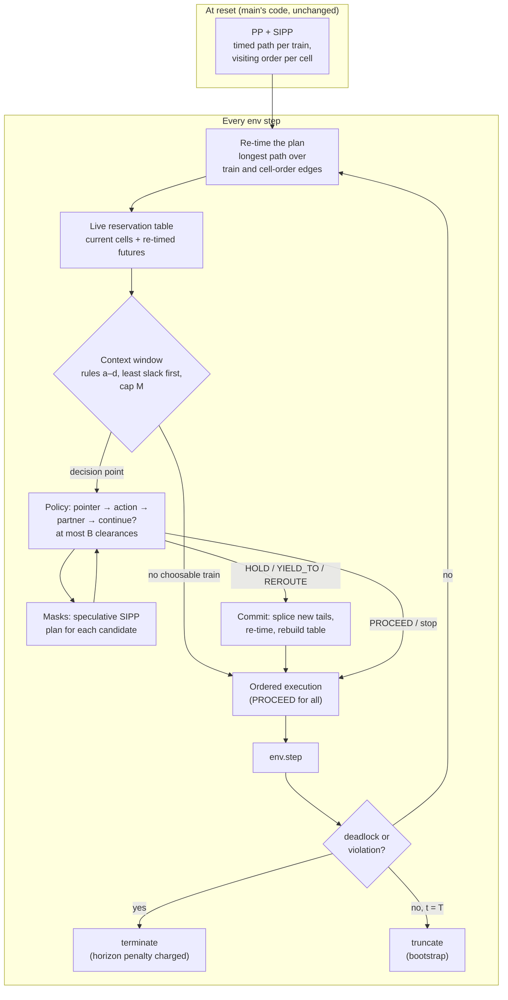

# 8. TADA on rails: a windowed dispatcher on top of the planner

This page describes an experiment on the `feat/tada-dispatcher` branch. It puts a small learned
dispatcher on top of the OR reference. The planner keeps doing what it is good at: timed,
collision-free paths for every train. The policy only decides, at a few trains per step, whether
to depart from that plan. The structure is taken from TADA, Leander's single-agent air-traffic
control project. Every number on this page comes from a run of the scripts listed under
[Reproduce](#reproduce), and the data files are linked next to each table.

<!-- TADA_SUMMARY:START -->
<!-- TADA_SUMMARY:END -->

## The analogy

TADA realises a predetermined landing sequence (the arrival manager, AMAN) under disturbances. The
environment keeps a context window of aircraft that may receive a clearance, the policy picks an
aircraft, then a clearance, then whether to issue another one, and masks keep it from exploring
anything unsafe or ill-timed. Flatland maps onto that almost one to one:

| TADA (air traffic control) | Flatland here | Code |
|---|---|---|
| AMAN landing sequence | OR plan: a timed path per train and a visiting order per cell (PP + SIPP) | `PrioritizedPlannerPolicy` in `baselines/or_planner.py` (main) |
| Aircraft follow their flight plan | PROCEED: every train follows its plan by ordered execution | `TadaExecutor.act` (inherited unchanged) |
| Separation minima, safety net | Live cell-time reservation table; no head-on or swap can be planned | `TadaExecutor.table`, `TrainTable` |
| Context window of controllable aircraft | Up to M trains chosen by rules (a) to (d) below, least slack first | `tada/window.py: build_window` |
| Clearances (heading, speed, level) | HOLD, YIELD_TO a partner, REROUTE at the next facing switch | `TadaExecutor.plan_clearance` |
| Clearance only at the right moment | Only at a decision instant: a cell exit, or ready to depart | `TadaExecutor.at_decision` |
| Aircraft-choice and action masks | Choosable mask; exact action masks from speculative SIPP plans | `DispatchEnv.action_mask` |
| At most 2 clearances per step | Budget B = 2, continue head | `policy.act_at_point` |
| High-severity infringement ends the episode | Termination: deadlock or reservation violation | `DispatchEnv._deadlock` |
| Timeout | Truncation at the horizon T, with bootstrap | `DispatchEnv._env_step` |
| AMAN is fixed (TADA's main limitation) | The plan is re-timed every step, and edited tails are replanned with SIPP | `TadaExecutor.retime`, `commit` |

One difference works in our favour. TADA's AMAN could not be recomputed, which capped what the
policy could fix. Here every clearance replans the affected trains' tails in milliseconds, so the
learned layer only owns the deviations from the plan.

## Architecture



### Executor

`TadaExecutor` subclasses main's planner and changes nothing about how a plan is followed. With
every clearance set to PROCEED it runs main's code path step for step (verified below). What it
adds:

- **Re-timing.** A malfunction does not make an ordered plan infeasible, only late. Every step the
  executor computes, for every future visit, the earliest time consistent with the planned time,
  where the train is now (dwell and malfunction included), and the visiting order of every cell.
  That is a longest-path computation over two kinds of edges: a train's consecutive visits (+k steps
  per cell) and consecutive visitors of one cell (the next enters when the previous one leaves).
  Main's plans contain zero-delay rotation cycles (three or more trains moving round a loop in one
  step, which flatland allows), so it is solved by relaxation rather than a topological sort.
- **Live reservation table.** Every train's current cell and re-timed future are reserved. Edits are
  searched against this table, never against the original planned times: a late train's stale
  intervals would look free, and an edit could be scheduled head-on against it.
- **Clearances.** HOLD replans the train to leave its cell (or depart) no earlier than 5 steps later
  than it could. YIELD_TO plans the partner first and then the train, which swaps their order on
  the shared cells. REROUTE forbids the planned branch at the next facing switch within D decision
  instants. Each is a speculative SIPP search from where the trains stand; if any search fails, the
  table is left exactly as it was and the action is masked.
- **Commit.** New tails are spliced into the visit lists, every plan is re-timed, and the table is
  rebuilt. The visiting order stays a consistent collision-free schedule, so ordered execution
  stays deadlock-free.

### Context window

All rules are evaluated on the re-timed schedule. A train enters the window if:

- **(a) conflict:** within the next H steps it directly precedes or follows another train in some
  cell's visiting order;
- **(b) plan infeasible:** its projected arrival is later than its latest arrival LA, or beyond
  the horizon;
- **(c) approach:** another train uses, within H, a cell on its path up to its D-th decision cell
  (a diverging switch, or the cell just before any switch) or the segment after it;
- **(d) departure:** it is ready to depart and its first segment is occupied now or reserved
  within H.

Members are ranked by slack `LA - (t + k * remaining cells)`, least first, and capped at M
(defaults H = 30, D = 3, M = 8).

Each member is a vector of 14 numbers:
- slack and speed;
- steps to its next decision cell and distance to target;
- how many trains directly precede and follow it in shared cells within H, and the least slack
  among them;
- malfunction steps left;
- plan-feasible and off-map flags;
- projected delay against LA;
- at-decision flag;
- lag behind the original plan;
- whether rule (b) admitted it.

Feature set (ii) adds six numbers for each of up to three branches ahead: whether the branch
exists, its extra distance to target, the distance to and number of opposing trains, the distance to
the next same-direction train, and whether its first cell is occupied. These come from the branch
scan in main's compact observation (`_scan_branch`), a cheap stand-in for flatland's tree
observation. A train is choosable only if it is at a decision instant and
has a legal action other than PROCEED.

### Policy and training

A one-layer transformer encoder (d = 64, 4 heads) reads the window plus a global token. The empty
window is valid. Per clearance it chooses a train (pointer), an action (masked), a partner for
YIELD_TO (a second pointer, masked to the partners whose swap plans succeed), and whether to
continue, with the environment capping the sequence at B. The joint log-probability is the sum
over the sequence. Training is PPO on decision points as a semi-MDP: the reward between two
decision points is discounted per env step, and the bootstrap is cut only on termination.

The reward is main's: `DefaultRewards` summed over trains and scaled by 100 / (N T), so an episode's
return is 100 times (normalised reward - 1). Flatland charges a train that misses its target only
at the horizon. On termination, every unfinished train is charged that penalty as if it stayed put
until T, so ending an episode early can never score better than running it out.

## Step 1: the executor reproduces main exactly

<!-- TADA_VERIFY:START -->
<!-- TADA_VERIFY:END -->

## Step 2: window occupancy

<!-- TADA_OCCUPANCY:START -->
<!-- TADA_OCCUPANCY:END -->

## Results on medium

<!-- TADA_MEDIUM:START -->
<!-- TADA_MEDIUM:END -->

## Ablations

<!-- TADA_ABLATIONS:START -->
<!-- TADA_ABLATIONS:END -->

## Generalisation without retraining

<!-- TADA_GENERAL:START -->
<!-- TADA_GENERAL:END -->

## Continuous Flatland

<!-- TADA_CONTINUOUS:START -->
<!-- TADA_CONTINUOUS:END -->

## What did not work

<!-- TADA_FAILED:START -->
<!-- TADA_FAILED:END -->

## Reproduce

All commands run from the repository root on the `feat/tada-dispatcher` branch, CPU only.

```bash
python scripts/tada_verify.py --workers 8                 # step 1 checks -> data/tada/verify.json
python scripts/tada_train.py --name main                  # step 3, 120 x 8 medium episodes
python scripts/tada_evaluate.py --name executor           # executor alone, medium
python scripts/tada_evaluate.py --name main               # learned dispatcher, medium
bash scripts/tada_ablations.sh                            # step 4 (trains and evaluates every ablation)
python scripts/tada_evaluate.py --name main --scenarios small large xlarge --out main_general   # step 5
python scripts/tada_continuous.py --name main             # step 6
python scripts/tada_report.py                             # tables and figures on this page
```
