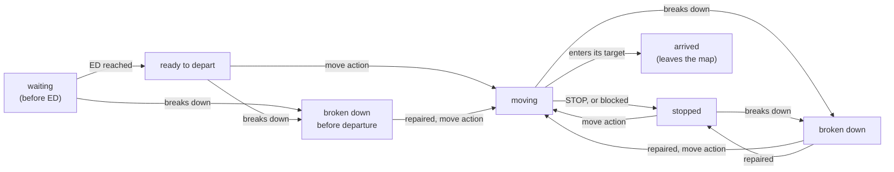

# :fl-train: Trains, timetables and breakdowns

!!! abstract "The question"

    What does a Flatland train know about time, how does it move from cell to cell, and what
    happens when it breaks down?

## Speed classes

Every train has a maximum speed of \(1/k\) cells per step, \(k \in \{1, 2, 3, 4\}\): a slow train
spends \(k\) steps in each cell and can leave only at the last of them, the **cell exit**. Between
exits it is committed: whatever it is told, it rolls on inside the cell. Flatland tracks this with a
speed counter. With the benchmark settings a train runs at its maximum speed or stands still, so the
counter is simply "steps spent in this cell" (`SpeedCounter`, flatland-rl 4.3.0). A train enters
its start cell one step after it becomes ready to depart, and it leaves the map in the step it
enters its target cell.

## The timetable

Train \(i\) may not depart before its **earliest departure** \(ED_i\) and should arrive by its
**latest arrival** \(LA_i\). The generator gives every train a travel allowance of
\(\lceil 1.3\,\tau_i + 0.2\,\bar\tau \rceil\) steps on top of its shortest-path time \(\tau_i\), and
draws \(ED_i\) so that it can still arrive by \(0.95\,T\)
([The problem](../01-problem.md#trains-and-timetable)).

The single most useful derived quantity is a train's **slack**:

\[
\text{slack}_i = LA_i - ED_i - \tau_i, \qquad \tau_i = k_i\,\ell_i ,
\]

the number of steps it can lose and still arrive on time. The Flatland 3 winner ordered trains by
slack, tightest first, breaking ties by speed
([Chen et al. 2023, §3](https://arxiv.org/abs/2306.06455)). So did the ECML 2026 winner
([repo](https://github.com/darshanmakwana412/ecml2026)). The 2019 winner put fast trains first,
because a fast train that has already left the network cannot be delayed by later disruptions
([Andreica interview](https://www.aicrowd.com/blogs/flatland-mugurel)). In RL terms, slack is the
natural feature for a learned priority, and giving each train a notion of priority was one of the
things that separated the better RL entries (JBR_HSE fed each agent a random "handle" as a
priority feature, [Laurent et al. 2021, §4.2](http://proceedings.mlr.press/v133/laurent21a/laurent21a.pdf)).

## The state machine

A train is always in one of seven states. Departing, stopping and breaking down are transitions
between them, decided inside `env.step` from the action, the train's position and its breakdown
counter:

A moving train that cannot enter its next cell (another train holds it) is set to *stopped* by the
environment; it has to be told to move again.

## Breakdowns

A **malfunction** freezes a train for a number of steps, on or off the map. Flatland draws one
breakdown lottery per train per step from the environment's random stream, whatever the trains do,
so on a given map and seed every policy meets exactly the same breakdowns (the rates and
durations are below). With malfunctions off, the same maps run without them, which makes every
comparison in this repository paired.

A breakdown does more damage than its own length. A broken train holds its cell, every train
behind it on the same track waits, and a train that was due to pass it in the opposite direction
on single track has to wait too. Chapter 5 shows how a plan absorbs that.

[A breakdown in the Lab (train 6 at t = 26)](7-lab.md?map=medium-1003-m&preset=or&t=26&train=6){ .fl-try } [The same map without breakdowns](7-lab.md?map=medium-1003-n&preset=or&t=26&train=6){ .fl-try }

## What the numbers look like

Generated networks are sparse. On our 10 held-out seeds per scenario (computed by
`python scripts/evaluate.py --stats`, stored in [`data/scenarios/scenario_stats.json`](https://github.com/leandergrech/rl-flatland-rescheduling/blob/main/data/scenarios/scenario_stats.json), flatland-rl
4.3.0; the last two columns are the median over seeds of each seed's median train):

| Scenario | Grid | Trains | Cities | Rail cells (mean) | Switch cells (mean) | Horizon \(T\) (min to max) | Shortest-path time \(\tau\) | Slack \(LA - ED - \tau\) |
|---|---|---|---|---|---|---|---|---|
| small | 30×30 | 10 | 2 | 103 | 25 | 129 to 226 | 60 steps | 36 steps |
| medium | 50×50 | 30 | 4 | 332 | 57 | 439 to 902 | 127 steps | 76 steps |
| large | 80×80 | 60 | 6 | 562 | 82 | 1,010 to 1,450 | 200 steps | 114 steps |
| xlarge | 100×100 | 100 | 8 | 886 | 108 | 1,116 to 2,021 | 264 steps | 147 steps |

*The table above as a chart. Left: range of the episode horizon over the 10 held-out seeds. Right: the median train's shortest-path travel time plus its slack, i.e. the whole window between earliest departure and latest arrival.*

Only about 11% of cells carry track at 30×30 and 9% at 100×100, so trains share a small number of
corridors between cities. The median train's slack is about 0.6 times its own shortest-path travel
time: enough to wait once or twice at a junction, not enough to wait behind a long queue.

The 2020 competition used malfunction rates between 0 and 1/250 per train-step with durations of
20 to 50 steps
([Laurent et al. 2021, §2.2 and App. B](http://proceedings.mlr.press/v133/laurent21a/laurent21a.pdf)).
Our malfunction splits use a rate of 1/1000 per train-step with the same durations. So a train on
the map for 500 steps expects about 0.5 breakdowns.

!!! tip "What it means for the agent"

    - **A semi-MDP.** A slow train decides once every \(k\) steps, at its cell exits, and only at
      decision cells (chapter 1). Discounting per environment step, not per decision, is what
      keeps returns comparable across speed classes.
    - **Departure is a decision.** Leaving at \(ED_i\) is allowed, not required. Holding a train
      at its station is the cheapest way to avoid a conflict, and it is free until the slack runs out.
    - **Breakdowns are exogenous and paired.** The same draws hit every policy on a seed, so a
      difference between two policies on the same seed is the policy's doing, not luck.

??? question "Check yourself"

    1. A train of speed 1/3 entered a cell at step 10. When can it next change cell? *At step 13,
       its third step in the cell; it cannot leave earlier whatever it is told.*
    2. In the widget, break train 2 while it is moving. Which state does it go to, and where does
       it end up afterwards? *Broken down; when the counter reaches zero it is stopped and needs a
       move action, which the widget always gives, so it is moving again one step later.*
    3. Why do this repository's tables compare policies on the same seeds with and without
       malfunctions? *Because breakdowns are drawn independently of the policy, so the paired
       difference isolates what breakdowns cost.*
