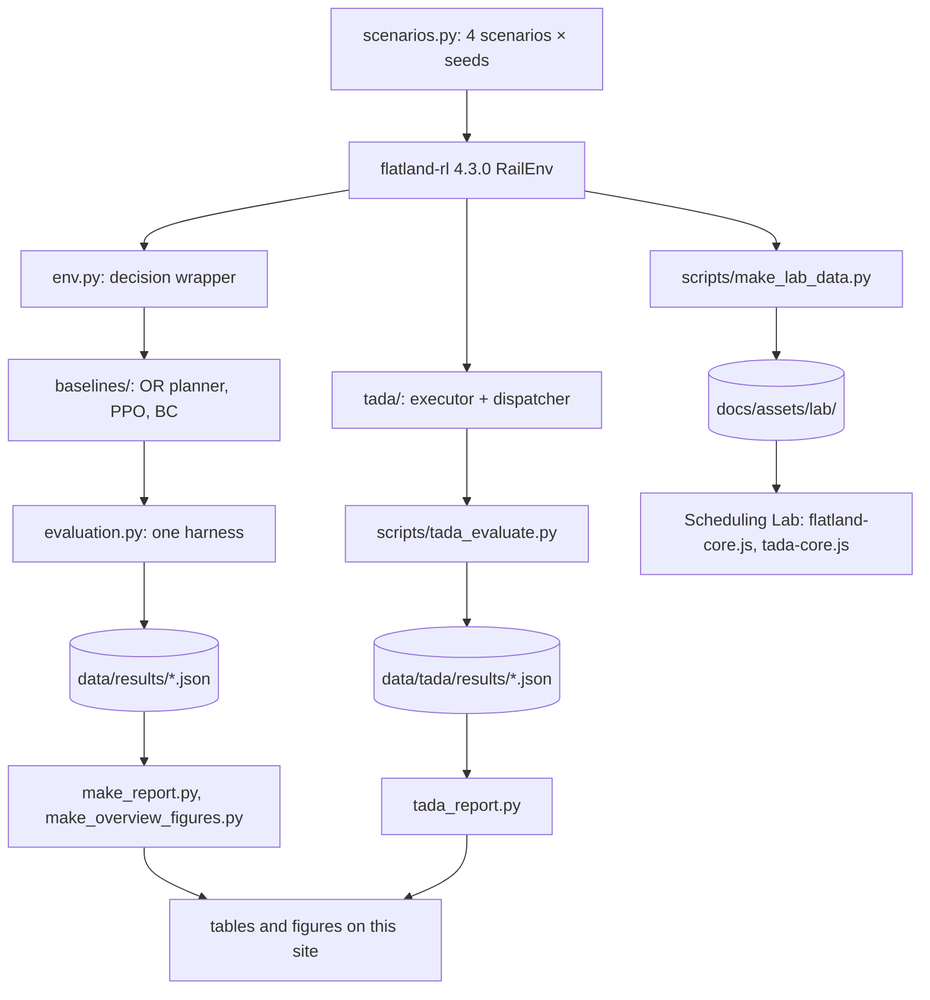

# :fl-code: Architecture

The repository has three parts that share one set of maps: a Python package that wraps flatland-rl
and holds every controller, scripts that turn stored episodes into the tables and figures on this
site, and a JavaScript port that replays the same maps in the browser. This page shows how they fit
together and where each number comes from. To run it, see
[Reproducing the results](reproduce.md).

## The codebase in one paragraph

`rl_flatland` wraps flatland-rl 4.3.0 with four fixed scenarios and seed splits, a decision
interface that asks a train for an action only where it matters (departure, and before or at a
switch), a 28-feature compact observation and flatland's tree observation. Baselines, all evaluated
by the same harness on the same held-out seeds with and without malfunctions:

- an **OR reference** reproducing the core of the 2019 and 2020 winners (prioritized planning with
  safe-interval search, executed in planned cell order so it cannot deadlock);
- **PPO** with parameter sharing over trains, written as a semi-MDP;
- **imitation then RL**: behaviour cloning on the OR planner's decisions, then PPO fine-tuning;
- two rule-based references (uncoordinated shortest paths, and a reactive heuristic).

On top of the OR reference, `rl_flatland.tada` adds the learned dispatcher of
[TADA on rails](../08-tada-dispatcher.md): an executor with editable plans, a context window, a
set-based policy and its PPO trainer.

## From a seed to a number on this site

Every evaluation writes one row per episode (policy, scenario, split, seed, trains arrived,
normalised reward, deadlocked trains, steps, wall-clock). The report scripts only read those rows,
so a table or a figure can be rebuilt without running a single episode, and a re-run can be
compared with the stored rows exactly (`scripts/check_reproduction.py`).

## Python package: `src/rl_flatland`

| Module | Role |
|---|---|
| [`scenarios.py`](https://github.com/leandergrech/rl-flatland-rescheduling/blob/main/src/rl_flatland/scenarios.py) | The four scenarios and the seed splits; a scenario plus a seed fixes the network, trains, timetable and breakdowns |
| [`graph.py`](https://github.com/leandergrech/rl-flatland-rescheduling/blob/main/src/rl_flatland/graph.py) | The rail network as configurations (cell, heading) and their successors; decision cells; distances |
| [`env.py`](https://github.com/leandergrech/rl-flatland-rescheduling/blob/main/src/rl_flatland/env.py) | The multi-agent wrapper: decisions only at departure and switches, three actions (WAIT, GO, GO-alternative) |
| [`observations.py`](https://github.com/leandergrech/rl-flatland-rescheduling/blob/main/src/rl_flatland/observations.py) | The 28-feature compact observation and a wrapper around flatland's tree observation |
| [`deadlock.py`](https://github.com/leandergrech/rl-flatland-rescheduling/blob/main/src/rl_flatland/deadlock.py) | Which trains can never move again |
| [`metrics.py`](https://github.com/leandergrech/rl-flatland-rescheduling/blob/main/src/rl_flatland/metrics.py) | Arrival rate and flatland's normalised reward |
| [`evaluation.py`](https://github.com/leandergrech/rl-flatland-rescheduling/blob/main/src/rl_flatland/evaluation.py) | Runs any policy on the fixed seed sets, in parallel workers, and returns one row per episode |
| [`policies.py`](https://github.com/leandergrech/rl-flatland-rescheduling/blob/main/src/rl_flatland/policies.py) | The common policy interface, shortest path and the reactive rule |
| [`baselines/or_planner.py`](https://github.com/leandergrech/rl-flatland-rescheduling/blob/main/src/rl_flatland/baselines/or_planner.py) | The OR reference: prioritized planning, SIPP, ordered execution, eight priority orderings |
| [`baselines/ppo.py`](https://github.com/leandergrech/rl-flatland-rescheduling/blob/main/src/rl_flatland/baselines/ppo.py) | Parameter-shared PPO as a semi-MDP, sized for a laptop CPU |
| [`baselines/imitation.py`](https://github.com/leandergrech/rl-flatland-rescheduling/blob/main/src/rl_flatland/baselines/imitation.py) | Demonstrations from the planner, behaviour cloning, then PPO |
| [`tada/executor.py`](https://github.com/leandergrech/rl-flatland-rescheduling/blob/main/src/rl_flatland/tada/executor.py) | The planner with editable plans: re-timing, a live reservation table, checked clearances |
| [`tada/planning.py`](https://github.com/leandergrech/rl-flatland-rescheduling/blob/main/src/rl_flatland/tada/planning.py) | A reservation table that remembers which train owns each interval; SIPP from any state |
| [`tada/window.py`](https://github.com/leandergrech/rl-flatland-rescheduling/blob/main/src/rl_flatland/tada/window.py) | The context window: which trains the dispatcher may act on, and their features |
| [`tada/policy.py`](https://github.com/leandergrech/rl-flatland-rescheduling/blob/main/src/rl_flatland/tada/policy.py), [`tada/ppo.py`](https://github.com/leandergrech/rl-flatland-rescheduling/blob/main/src/rl_flatland/tada/ppo.py), [`tada/env.py`](https://github.com/leandergrech/rl-flatland-rescheduling/blob/main/src/rl_flatland/tada/env.py) | The set-based dispatcher policy, its PPO trainer and its environment |
| [`tada/continuous.py`](https://github.com/leandergrech/rl-flatland-rescheduling/blob/main/src/rl_flatland/tada/continuous.py) | A continuous-traffic variant: trains keep arriving on one map |
| [`theme.py`](https://github.com/leandergrech/rl-flatland-rescheduling/blob/main/src/rl_flatland/theme.py), [`figures.py`](https://github.com/leandergrech/rl-flatland-rescheduling/blob/main/src/rl_flatland/figures.py), [`plotting.py`](https://github.com/leandergrech/rl-flatland-rescheduling/blob/main/src/rl_flatland/plotting.py) | Figure colours and every chart on the site, in a light and a dark version |

## Design decisions

Each is argued where it matters; the short version:

- **Decisions only where they matter.** A train is asked for an action only at departure and at
  the cells before or at a switch, instead of at every step, so the learned baselines face a
  semi-MDP ([environment wrapper](../04-designs.md#environment-wrapper-and-observations)).
- **A custom PPO trainer**, not Stable-Baselines3, because trains appear and disappear and act at
  different times ([why](../04-designs.md#why-a-custom-ppo-trainer)).
- **A deterministic planner.** The planner's optional wall-clock cap is off, so its plan does not
  depend on machine load and its results can be compared exactly
  ([methods](../research/methodology.md#controllers-compared)).
- **The dispatcher changes nothing until it acts.** With every clearance set to PROCEED, the
  executor takes exactly the planner's code path; this was checked on all 80 evaluation episodes
  before any training ([step 1](../08-tada-dispatcher.md#step-1-the-executor-reproduces-main-exactly)).
- **The browser reproduces Python, not an approximation of it.** The Lab's port follows
  flatland-rl's step function, including the order in which Python iterates sets, and is checked
  episode by episode ([how faithful it is](../how/7-lab.md#how-faithful-it-is)).

## Where each number comes from

| On the site | Produced by | From |
|---|---|---|
| Results tables and figures in [Designs and results](../04-designs.md#results-on-our-scenarios), the README table, [Limitations](../05-limitations.md#on-our-mid-size-scenarios) | `python scripts/make_report.py` | `data/results/*.json`, `data/checkpoints/*/` |
| Home page and [Methods](../research/methodology.md) overview figures | `python scripts/make_overview_figures.py` | `data/results/*.json`, `data/tada/results/{main,main_general}.json` → `data/analysis/overview.json` |
| Where failed trains end up | `python scripts/failure_modes.py` | re-runs the held-out seeds → `data/analysis/failure_modes.json` |
| Every table and figure on [TADA on rails](../08-tada-dispatcher.md) | `python scripts/tada_report.py` | `data/tada/` |
| Scenario statistics (horizons, track and switch cells, travel times, slack) | `python scripts/evaluate.py --stats` | `data/scenarios/scenario_stats.json` |
| Literature numbers | copied by hand | the source linked next to each one ([References](../07-references.md)) |
| The Lab's maps and recorded episodes | `python scripts/make_lab_data.py` | flatland-rl, the stored checkpoints → `docs/assets/lab/` |

## Tests and continuous integration

- `pytest` runs environment sanity checks, a smoke test for every baseline, the dispatcher's
  executor and window, and the figure palette.
- `node scripts/check_lab.mjs` checks the browser port against fixtures exported from flatland-rl:
  distances, five recorded policies, the live planner and the dispatcher's recorded clearances on
  all 40 maps.
- GitHub Actions run the tests on every push to `main` and every pull request
  ([`ci.yml`](https://github.com/leandergrech/rl-flatland-rescheduling/blob/main/.github/workflows/ci.yml)),
  and build this site with `mkdocs build --strict` and publish it from `main`
  ([`pages.yml`](https://github.com/leandergrech/rl-flatland-rescheduling/blob/main/.github/workflows/pages.yml)).

## The site

MkDocs Material 9.7.7 with a custom theme ("Departure board"), no build step beyond `mkdocs build`.
The interactive parts are plain JavaScript files with no dependencies: `flatland-core.js`
(flatland's environment and the planner), `tada-core.js` (the dispatcher's executor),
`rail-draw.js` (drawing), `widgets.js` (the chapter models) and `lab.js` (the Lab). Equations are
typeset by MathJax, loaded only on pages that contain one.
